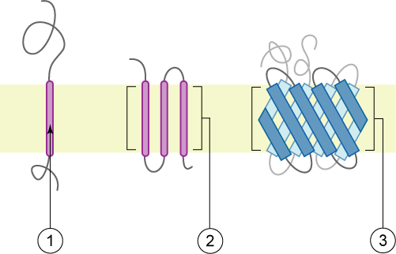
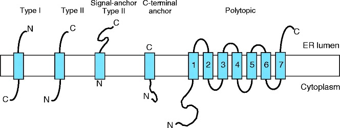

```{r echo=FALSE, output=FALSE}

library(webexercises)
```

1D features are protein characteristics that can be directly interpreted from
the protein's primary sequence and represented as values assigned to each
residue in the sequence. For example, we can assign a secondary structure state
(symbol or probability) to each residue. Many structure prediction methods use
or incorporate third-party methods to predict secondary structure and other 1D
features, which provide crucial information during the modeling process.

You can find links to several 1D features prediction tools in the [Modeling
Resources](links.html) section.

# Protein secondary structure prediction

## Multiple state of secondary structures

Secondary structures are assigned to structures using the **DSSP** (Define
Secondary Structure of Proteins) algorithm, originally created in 1983 and
updated several times, with the latest version available on
[GitHub](https://github.com/PDB-REDO/dssp) from 2021. The DSSP algorithm
classifies each residue based on its geometry and predicted hydrogen bonds by
comparing it with patterns in the DSSP database. Importantly, DSSP does not
predict secondary structures; it simply extracts this information from the 3D
coordinates.

Most protein secondary structure prediction (PSSP) methods use a three-state
model, categorizing secondary structures into helix (H), sheet (E), and coil
(C). Helix and sheet are the main conformations proposed by Linus Pauling in the
early days of structural biology, while coil (C) refers to any amino acid that
does not fit into either helix or sheet categories. This three-state model is
still widely used, but it has limitations, as it oversimplifies the backbone
structure, often missing deviations from standard helix and sheet conformations.

In the 1980s, an eight-state secondary structure model was proposed, including
α-helix (H), 310-helix (G), parallel/anti-parallel β-sheet (E), isolated
β-bridge (B), bend (S), turn (T), π-helix (I), and coil (C). DSSP defines these
eight states in experimentally obtained structures and includes transformations
for mapping eight-state structures to three-state models (see @ismi2022).

More recently, in 2020, four-state and five-state PSSP models were introduced to
simplify predictions and increase accuracy. These new models address the
imbalance in sample sizes for certain classes, like isolated β-bridge (B) and
bend (S), which have fewer samples and lower true-positive rates. In the
five-state model, B and S are categorized as C, while in the four-state model,
B, S, and G are categorized as C. Additionally, 75% of π-helix (I) occurrences
are found at the beginning or end of an α-helix (H), so they are categorized as
H. The full potential of these new categories is still being explored.

## Evolution of Prediction methods

Protein secondary structure prediction (PSSP) from protein sequences is based on
the idea that segments of consecutive residues have preferences for certain
secondary structure states. Like other methods in bioinformatics, including
protein modeling, approaches to secondary structure prediction have evolved over
the last 50 years (see Table 1).

The first generation methods relied on statistical approaches, where prediction
depended on assigning a set of prediction values to a residue and then applying
a simple algorithm to those numbers. This meant applying a probability score
based on single amino acid propensity. In the 1990s, new methods included the
information of the flanking residues (3-50 nearby amino acids) in the so-called
Nearest Neighbor (N-N) Methods. These methods increased the accuracy in many
cases but still had strong limitations, as they only considered three possible
states (helix, strand, or turn). Moreover, as you know from the secondary
structure practice, β-strand predictions are more difficult and did not improve
much thanks to N-N methods. Additionally, predicted helices and strands were
usually too short.

By the end of the 1990s, new methods boosted the accuracy to values near 80%.
These methods included two innovations, one conceptual and one methodological.
The conceptual innovation was the inclusion of evolutionary information in the
predictions, by considering the information of multiple sequence alignments or
profiles. If a residue or a type of residue is evolutionary conserved, it is
likely that it is important for defining secondary structure stretches. The
methodological innovation was the use of neural networks, in which multiple
layers of sequence-to-structure predictions were compared with independently
trained networks.

Since the 2000s, most commonly used methods are meta-servers that compare
several algorithms, mostly based on neural networks, such as JPred or SYMPRED,
among others.

In recent years, deep neural networks trained with large datasets have become
the primary method for protein secondary structure prediction (and almost any
other prediction in structural biology). In the Alphafold era (see the last
lesson), methods adapted from image processing or natural language processing
(NLP) are also used (for instance, in NetSurfP-3.0, see @høie2022), allowing
protein secondary structure predictions to focus on specific objectives, such as
enhancing the quality of evolutionary information for protein modeling
[@ismi2022].

+------------------------------+------------------------------+--------------+
| **Generation**               | **Method**                   | **Accuracy** |
+------------------------------+------------------------------+--------------+
| 1st: Statistics              | Chow & Fassman (1974-)       | 57%          |
+------------------------------+------------------------------+--------------+
|                              | GOR (1978-)                  |              |
+------------------------------+------------------------------+--------------+
| 2nd: Nearest Neighbor (N-N)  | PREDATOR (1996)              | 75%          |
| methods                      |                              |              |
+------------------------------+------------------------------+--------------+
|                              | NNSSP (1995)                 | 72%          |
+------------------------------+------------------------------+--------------+
| 3rd: N-N neural network &    | APSSP                        | Up to 86%    |
| evolutionary info            |                              |              |
+------------------------------+------------------------------+--------------+
|                              | PsiPRED (1999-)              | 75.7% (1999) |
|                              |                              |              |
|                              |                              | 84% (2019)   |
+------------------------------+------------------------------+--------------+
|                              | PHD (1997)                   |              |
+------------------------------+------------------------------+--------------+
| 4th: Multiple layers of info | Extra layers of info, such   | \<80%        |
|                              | as conserved domains,        |              |
|                              | frequent patterns, contact   |              |
|                              | maps or predicted residue    |              |
|                              | solvent accessibility        |              |
|                              | (2000s)                      |              |
+------------------------------+------------------------------+--------------+
| 5th generation               | Sophisticated deep learning  | \>80%        |
|                              | architectures and NLP        |              |
|                              | (2010s, 2020s).              |              |
|                              |                              |              |
|                              | RaptorX-Property, (2018),    |              |
|                              | SPIDER3 (2020) and           |              |
|                              | NetSurfP-3.0 (2022), among   |              |
|                              | others.                      |              |
+------------------------------+------------------------------+--------------+
| **META-Servers**             | Jpred4                       |              |
+------------------------------+------------------------------+--------------+
|                              | GeneSilico (Discontinued)    |              |
+------------------------------+------------------------------+--------------+
|                              | SYMPRED                      |              |
+------------------------------+------------------------------+--------------+

: Evolution of secondary structure prediction methods (modified from @ismi2022).

# Structural disorder and solvent accessibility

The expression *disorder* denote protein stretches that cannot be assigned to
any SS. They are usually dynamic/flexible, thus with high B-factor or even
missing in crystal structures. These fragments show a low complexity and they
are usually rich in polar residues, whereas aromatic residues are rarely found
in disordered regions. These motifs are usually at the ends of proteins or
domain boundaries (as linkers). Additionally, they are frequently related to
specific functionalities, such in the case of proteolytic targets or
protein-protein interactions (PPI). More rarely, large disordered domains can be
conserved in protein families and associated with relevant functions, as in the
case of some transcription factors, transcription regulators, kinases...

There are many methods and servers to predict disordered regions. You can see a
list in the Wikipedia
[here](https://en.wikipedia.org/wiki/List_of_disorder_prediction_software) or in
the review by @atkins2015. The best-known server is
[DisProt](https://www.disprot.org/), which uses a large curated database of
intrinsically disordered proteins and regions from the literature, which has
been recently improved to version 9 in 2022, as described in @quaglia2022.

Interestingly, a low plDDT (see [below](advanced.html#scores)) score in
Alphafold2 models has been also suggested as a good indicator of protein
disorder [@wilson2022].

.](pics/imageSwap.gif){#fig-disprot
.figure}

*Hydrophobic collapse* is usually referred to as a key step in protein folding.
Hydrophobic residues tend to be buried inside the protein, whereas hydrophilic,
polar amino acids are exposed to the aqueous solvent.

.](pics/collapse.png "Hydrophobic collapse"){#fig-collapse
.figure}

Solvent accessibility correlates with residue hydrofobicity (accessibility
methods usually better performance). Therefore, estimation of how likely each
residue is exposed to the solvent or buried inside the protein is useful to
obtain and analyze protein models. Moreover, this information is useful to
predict PPIs as well as ligand binding or functional sites. Most methods only
classify each residue into two groups: Buried, for those with relative
accessibility probability \<16% and Exposed, for accessibility residues \>16%.

Most common recent methods, like [ProtSA](http://webapps.bifi.es/ProtSA/) or
[PROFacc](www.rostab.org), combine evolutionary information with neural networks
to predict accessibility.

# Trans-membrane motifs and membrane topology

Identification of transmembrane motifs is also a key step in protein modeling.
About 25-30% of human proteins contain transmembrane elements, most of them in
alpha helices.

{#fig-TM .figure}

The PDBTM ([Protein Data Bank of Transmembrane
Proteins](http://pdbtm.enzim.hu/)) is a comprehensive and up-to-date
transmembrane protein selection. As of September 2022, it contains more than
7600 transmembrane proteins, 92.6% of them with alpha helices TM elements. This
number of TM proteins is relatively low, as compared with more than 160k
structures in PDB, as TM proteins are usually harder to purify and
crystalization conditions are often elusive. Thus, although difficult, accurate
predictions of TM motifs and overall protein topology can be essential to define
protein architecture and identify domains that could be structurally or
functionally studied independently.

{#fig-topo .figure}

Current state-of-the-art TM prediction protocols show an accuracy of 90% for
definition of TM elements, but only a 80% regarding the protein topology.
However, some authors claim that in some types of proteins, the accuracy is not
over 70%, due to the small datasets of TM proteins. Most recent methods, based
in deep-learning seem to have increased the accuracy to values near 90% for
several groups of proteins [@hallgren].

# Subcellular localization tags and post-translational modification sites

Many cellular functions are compartmentalized in the nucleus, mitochondria,
endoplasmatic reticulum (ER), or other organules. Therefore, many proteins
should be located in those compartments. That is achieved by the presence of
some labels, in form of short peptidic sequences that regulate traffic and
compartmentalization of proteins within the cells. Typically, N-terminal signals
direct proteins to the mitochondrial matrix, ER, or peroxisomes, whereas nucleus
traffic is regulated by nuclear localization signals (NLS) and nuclear export
signals (NES). These short motifs are difficult to predict, as datasets of
validated signals are small. The use of consensus sequences allowed predictions,
although in many cases with a high level of uncertainty. As you can already
suspect, there are a bunch of new deep learning-based methods in the last
decade. If you are interested in this topic, check out the recent review by
Pollastri lab [@gillani2024].

Post-translational modifications often happen in specific patterns that include
important residues for processes like phosphorylation or ubiquitination. Here
also, using deep learning methods to predict these modifications can help
identify them accurately and quickly [@meng2022].

# References
