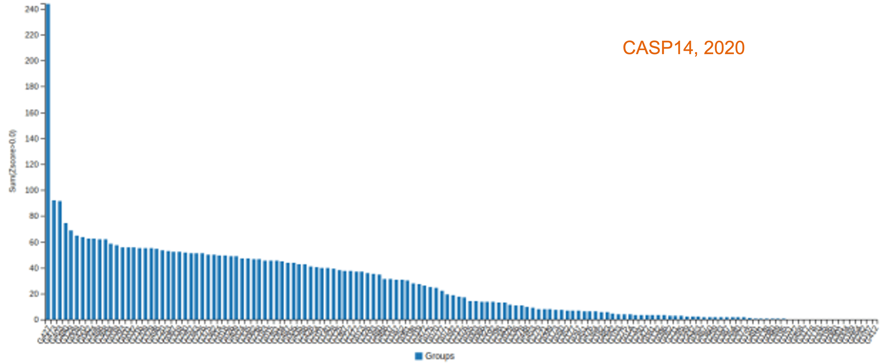
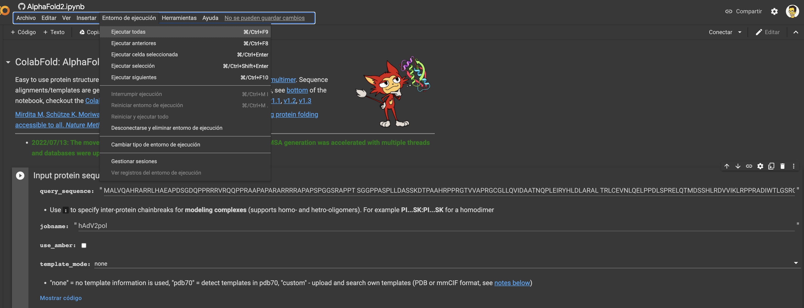

```{r echo=FALSE, output=FALSE}

library(webexercises)
```

# The history of protein structure modeling is told by a competition (CASP)

Every two years since 1994, groups in the field of structural bioinformatics
have conducted a worldwide experiment in which they predict a set of unknown
protein structures in a controlled, blind test-like competition and compare
their results with the experimentally obtained structures. That is the **CASP**
or [*Critical assessment of Protein Structure
Prediction*](https://predictioncenter.org/).

{#fig-CASP13 .figure}

The best research groups in the field test their new methods and protocols in
the CASP. However, at CASP13 (2018), an AI company called
[Deepmind](https://en.wikipedia.org/wiki/DeepMind) (Google Subsidiary) entered
the scene. Their method, named Alphafold [@senior2020] clearly won CASP13.
Alphafold (v.1) implemented improvements in some recently used approaches and
created an entirely new pipeline. Instead of creating contact maps from the
alignment and then folding the structure, they used an MRF unit (Markov Random
Field) to extract the main features of the sequence and MSA in advance and
process all this information into a multilayer NN (called ResNet) that also
predicted distance probabilities instead of contacts, resulting in high
accuracy. Then, Alphafold uses all the possibly obtained information to create
the structure and then improve it by energy minimization (steepest descent
method) and substitution of portions with a selected DB of protein fragments.

).](pics/alphafold1.png "Alphafold1"){#fig-alphafold1 .figure}

After Alphafold, similar methods were also developed and made available to the
general public, like the *trRosetta* [@yang2020], from the [Baker
lab](https://www.bakerlab.org/), available in
[Rosetta](https://www.rosettacommons.org/software) open source software and in
the [Robetta](https://robetta.bakerlab.org/) server. This led to some
controversy (mostly on Twitter) about the open access to the CASP software and
later on DeepMind publishes all the code on GitHub.

# CASP14 or when protein structure prediction come to age for (non structural) biologists

There was a lot of hype in CASP14 and the guys from DeepMind did not disappoint
anyone. Alphafold2 left all competitors far behind, both in relative terms
(score against the other groups) and in absolute terms (lowest alpha-carbon
RMSD). As highlighted earlier, the accuracy of many of the predicted structures
was *within* the margin of error of the experimental determination methods [see
for instance @mirdita2022].

[{#fig-casp14
.figure}](https://predictioncenter.org/casp14/zscores_final.cgi?formula=gdt_ts)

[{#fig-alphafold2bench
.figure}](https://www.nature.com/articles/s41586-021-03819-2/figures/1)

Deepming took some time (eight months, which is an eternity nowadays) to publish
the method (@jumper2021) and to release the code on
[Github](https://github.com/deepmind/alphafold), but other new methods, such as
RoseTTAfold (@baek2021) and C-I-Tasser (@zheng2021) were able to obtain similar
results and were available on public servers, which may have pushed Deepmind to
make it all available to the scientific community[^1]. Not surprisingly, a group
of independent scientists ([Sergey Ovchinnikov](https://twitter.com/sokrypton),
[Milot Mirdita](https://twitter.com/milot_mirdita), and [Martin
Steinegger](https://twitter.com/thesteinegger)), decided to implement Alphafold2
in a [Colab notebook](https://github.com/sokrypton/ColabFold), called
**ColabFold** @mirdita2022, which freely available online using *Google Colab*
notebooks platform. Other free implementations of Alphafold have been and are
available, but ColabFold has been the most widely discussed and well known. They
implemented some tricks to speed up the modeling, most notably the use of
[MMSeqs2](https://docs.google.com/presentation/d/1mnffk23ev2QMDzGZ5w1skXEadTe54l8-Uei6ACce8eI/present#slide=id.ge58c80b745_0_15)
(developed by Martin Steinegger's group) to search for homologous structures on
Uniref30, which made Colabfold a fast method that made all the previous advanced
methods almost useless. This was the real breakthrough in the field of protein
structure prediction, making Alphafold accessible and, also very importantly,
facilitated the further development of the method, implementing very quickly new
features, like the prediction of protein complexes, which was actually first
mentioned on
[Twitter](https://docs.google.com/presentation/d/1mnffk23ev2QMDzGZ5w1skXEadTe54l8-Uei6ACce8eI/present#slide=id.ge58c80b745_0_15)
and then led to several new dedicated methods, including AlphaFold-multimer
[@evans2022] from Deepmind or AlphaPullDown [@yu2023].

[^1]: See
    https://www.wired.com/story/without-code-for-deepminds-protein-ai-this-lab-wrote-its-own/

# Alphafold as the paradigm of a New Era {#sec-AF2}

## Why is Alphafold so freaking accurate?

The philosophy behind Alphafold v.2 (from now on, just Alphafold) and related
methods is to treat the protein folding problem as a machine learning problem,
similar to image processing. In all of these problems, the input to the Deep
Learning model is a volume (3D tensor). In the case of computer vision, 2D
images expand as volumes because of the RGB or HSV channels. Similarly, in the
case of distance prediction, predicted 1D and 2D features are transformed and
packed into a 3D volume with many channels of inter-residue information
[@pakhrin2021].

{#fig-deep .figure}

Alphafold can be explained as a pipeline with three interconected tasks (see
picture below). First, in contrast to Alphafold v.1, the input to Alphafold is a
"raw" MSA, i.e., the deep learning network extracts the co-evolutionary
information directly from the MSA. It queries several databases of protein
sequences and constructs an MSA that is used to select templates. This can be a
limiting step, affecting the speed of modeling (see below), but it can be also
related to model accuracy, as has been recently shown in CASP15 [@lee.;
@peng2023].

In the second part of the diagram, AlphaFold takes the multiple sequence
alignment and the templates, and processes them in a *transformer* that they
named *Evoformer*. This process has been referred by some authors as
inter-residue interaction map-threading [@bhattacharya2021]. The objective of
this part is to extract layers of information to generate residue interaction
maps. The Evoformer refines both its understanding of the MSA and the predicted
3D structure in an iterative process. Improved predictions of amino acid
interactions help refine the MSA representation, and vice-versa.

The AF2 transformer architecture allows the model to process all amino acids in
a protein sequence simultaneously, rather than one at a time, through a
technique known as the attention mechanism. This is a significant advantage
because it enables the model to capture long-range relationships between amino
acids. Essentially, the attention mechanism helps a neural network to
concentrate on the most relevant parts of its input when making predictions. For
proteins, this means the network can learn which amino acids are likely to
interact with each other, even if they are far apart in the sequence. It's akin
to reading a lengthy document; you don't focus equally on every word but rather
on the key phrases that are crucial for understanding the overall meaning.

Importantly, in the AF2 Evoformer, this process is iterative and the information
goes back and forth throughout the network. At each recycling step, the model
refines its predictions of amino acid relationships, leading to a more accurate
structure (the original model uses 3 cycles). As explained in the great
[post](https://www.blopig.com/blog/2021/07/alphafold-2-is-here-whats-behind-the-structure-prediction-miracle/)
from Carlos Outerial at the OPIG site:

> *This is easier to understand as an example. Suppose that you look at the
> multiple sequence alignment and notice a correlation between a pair of amino
> acids. Let's call them A and B. You hypothesize that A and B are close, and
> translate this assumption into your model of the structure. Subsequently, you
> examine said model and observe that, since A and B are close, there is a good
> chance that C and D should be close. This leads to another hypothesis, based
> on the structure, which can be confirmed by searching for correlations between
> C and D in the MSA. By repeating this several times, you can build a pretty
> good understanding of the structure.*

The third part of the pipeline is the structure building module, which uses the
information from the previous steps to construct a 3D model structure protein of
the query sequence. This network will give you a single model, without heavy
energy optimization steps (only a relax protocol). Model building is based in a
new concept of 3D structures generation, named **IPA** (Invariant Point
Attention) and the use of a curated list of parametrized list of torsion angles
to generate the side chains. IPA allows the network to maintain rotational and
translational invariance, which is crucial for accurate 3D structure prediction.
Earlier attempts to develop and end-to-end method were unsuccessful because the
structure representation was not optimal. Even methods implemented after
AlphaFold, like RoseTTAFold, use less efficient methods and often predict very
quickly and accurately the backbone coordinates but require external programs to
generate an all-atoms model.

{#fig-af2 .figure}

Like for most of the previous methods Alphafold would give your better results
with proteins with related structures known and with a lot of homologs in Uniref
databases. However, comparing to nothing, it will likely give you (limited)
useful results for the so-called "dark genome". I work with phages and bacterial
mobile elements, and sequencing that is often frustrating as more than 50% of
the proteins have no homologous in the database. So you have a bunch of proteins
of unknown function... However, as we do know that structure is more conserved
than sequence, we may use the structure to find out the function of our dark
proteins. There are a few resources for this, I'd suggest you to try
[FoldSeek](https://search.foldseek.com/search) [@kempen] and
[Dali](http://ekhidna2.biocenter.helsinki.fi/dali/) [@holm2022] servers. You can
upload the PDB file of your model and search for related structures in RCSB PDB
database and also in Alphafold database.

::: callout-tip
*FoldSeek* needs only a few seconds/minutes and is therefore faster than *Dali*.
Therefore, it is better to use Dali for some selected searches that require a
double check or a more reliable result, even if it may take a few days.
:::

As mentioned above, Colabfold aims to make the process faster by using MMSeqs in
the first block. Additionally, the number of recycling steps can also be
adapted. Moreover, different Colabfold notebooks have been developed (and
evolved) to allow some customization and other feature, like batch processing of
multiple proteins avoiding recompilation and identification of protein-protein
interactions [@mirdita2022].

Alphafold models can be evaluated by the mean **pLDDT**, a per-residue
confidence metric. It is stored in the B-factor fields of the mmCIF and PDB
files available for download (although unlike a B-factor, higher pLDDT is
better). The model confidence can vary greatly along a chain so it is important
to consult the confidence when interpreting structural features. Very often, the
lower confidence fragments are not product of a poor prediction but an indicator
of protein disorder [@wilson2022]. Additionally, AF2 calculates the predicted
template modeling, or TM-scores (**pTM**) based on a pairwise error prediction,
and is used to calculate the predicted aligned error (**PAE**) that estimates
the error of the position of each amino acid. Interestingly, the PAE can be used
as a predictor for protein dynamics, as PAE correlates with distance variations
from the MD simulations [@guo2022a].

Alphafold also partnered with EMBL-EBI and Uniprot and generated a huge curated
database of proteins from model organisms [@varadi2022], the [Alphafold
database](https://alphafold.ebi.ac.uk/). This is an amazing resource that may be
also very helpful for you. Just consider that this database increased from 48%
to 76% the fraction of human proteome with structural data, and also it also
means great increases in the case of other model organisms, like, including
microorganisms and plants [@portapardo2022].

{#fig-afDDBB
.figure width="433"}

## [Wanna try Alphafold?]{style="color:green"}

*Section under construction!*

As mentioned above, the grand breakthrough of Alphafold would not have been the
same without the Colabfold, a free open tool that made the state-of-the-art of
AI-fueled protein prediction available to everyone.

[{#fig-colabfold
fig-align="left" width="441"}](https://github.com/sokrypton/ColabFold)

The [Colabfold](https://github.com/sokrypton/ColabFold) repository on GitHub
contains links to several Python notebooks developed on [Google
Colab](https://colab.research.google.com/), a platform to develop and share
Python scripts on a Jupyter Notebook format. Notebooks are very important also
for reproducibility in computer sciences, as they allow you to have the
background and details and the actual code in a single document and also execute
it. You can share those notebooks very easily and also update quickly as they
are stored in your Google Drive.

Colabfold allow you to run notebooks of Alphafold, RoseTTAfold, and ESMFold for
specific applications, allowing even to run a bunch of proteins in batch. You
can see a more detailed description in @mirdita2022. We are using the
[Alphafold2_mmseqs2](https://colab.research.google.com/github/sokrypton/ColabFold/blob/main/AlphaFold2.ipynb)
notebook, that allow you most of the common features. You need to allow Colab to
use your Google account.

{#fig-colabfold2}

Then paste your sequence and chose a name. For more accurate models you can
click "use_amber" option. It will run a short [*Molecular
Dynamics*](https://en.wikipedia.org/wiki/Molecular_dynamics) protocol that
ultimately optimize the modeling, but it will also take some more time, so
better try at home.

As you can see, an this is a recent feature, you can also add your own template,
which combines the classical "homology modeling" based upon a single template
with the advanced AlphaFold model construction method. That will safe time, but
of course without any guarantee. If you have a template of a related protein,
like an alternative splicing or a disease mutant, I'd advise you to try with and
without the template. You may surprise.

{#fig-colabfold3}

At this point, you may execute the whole pipeline or may some more
customization. MSA stage can be also optimized to reduce execution time, by
reducing database or even by providing your own MSA. Very often you may want to
fold a protein with different parameters, which may very convenient to reuse an
MSA from a previous run (although they recently updated servers for MMSeqs and
made it really faster). If your proteins are in the same operon or by any other
reason you think that they should have co-evolved, you prefer a "paired"
alignment. But you can always do both.

Advanced settings are specially needed for protein-protein complexes. Also the
number of recycling steps will improve your model, particularly for targets with
no MSA info from used databases. Then you can just get your model (and companion
info and plots) in your GDrive or download it.

[**What do you think is the ideal protein for AlphaFold? Do you think homology
modeling is dead?**]{style="color:green"}

## Now what? The Post-AlphaFold era (2022-2023)

As mentioned earlier, RoseTTAFold was released at the same time as AlphaFold's
paper and code, although it is clearly inspired by AlphaFold's capabilities in
CASP14. It is based on a three-track network, and recent implementations have
allowed prediction of protein interactions with nucleic acids. Other methods
such as AlphaFold and RoseTTAFold were released later, as were
[OpenFold](https://openfold.io/) and
[UniFold](https://colab.research.google.com/github/dptech-corp/Uni-Fold/blob/main/notebooks/unifold.ipynb),
which are based on the PyTorch Transformers AI framework. More recently,
RoseTTAFold2, which extends the three-track architecture over the whole network
and incorporate other new advances and AlphaFold tricks, like the FAPE (frame
aligned point error) or recycling steps during the training, giving rise to an
end-to-end model equivalent in accuracy to AF2 for monomers and AF2-multimer for
complexes, with better computational scaling on proteins and complexes larger
than 1000 residues [@baek].

The use of MSA has been cited as a limitation for AlphaFold and related methods.
However, the predictions are significantly worse without MSA or with MSAs
without depth. One way to improve predictions is to use a protein natural
language model (**PLMs**), i.e., a model trained to predict sequence from sequence
and not dependent on good MSAs.
[Omegafold](https://github.com/HeliXonProtein/OmegaFold) and
[ESMfold](https://esmatlas.com/resources?action=fold) (also in Colabfold,
[here](https://colab.research.google.com/github/sokrypton/ColabFold/blob/main/beta/omegafold.ipynb) and [here](https://colab.research.google.com/github/sokrypton/ColabFold/blob/main/ESMFold.ipynb), respectively) are two new implementations that require only a single sequence. While AlphaFold2 uses deep learning with multiple sequence alignments (MSAs) to infer protein structures, PLMs learn the "language" of protein sequences directly, representing amino acid sequences. Each amino acid (e.g., alanine, glycine) is represented as a "token," a numerical representation that the model can process. By training on extensive datasets of protein sequences, PLMs learn the patterns and relationships between amino acids, enabling them to predict 3D structures from single sequences. Essentially, PLMs treat amino acid sequences as "sentences," where each amino acid is a "word". This method offers advantages in speed and applicability, particularly for proteins without sufficient sequence homology. However, they may have lower overall accuracy compared to AlphaFold2 when MSAs are available.
PLMs perform efficiently when using a single sequence, often surpassing AlphaFold in this scenario. Nevertheless, although they can outperform AF2, since PLMs are trained on existing sequences, these methods still show reduced performance on orphan sequences. That is, the language models seem to replicate the training MSAs [@elofsson2023].

The appearance of ESMfold and the companion [Metagenomic
Atlas](https://esmatlas.com/) [@lin2023] was seen as a new step that could trigger
a new revolution in the field, since it was developed by scientists at META
[@callaway2022]. So it was now a sort of Google versus Facebook battle for the
most powerful AI methods for protein modeling. Last summer, however, we learned
that META had decided to discontinue the ESM project.




AlphaFold was again the protagonist of CASP15, which took place in 2020, but it
did not overwhelm the rest like in 2018.





AlphaFold was used in some form in more than half of the protocols, and while
the standard AlphaFold method performed better than many other methods, several
groups achieved significant improvements for monomeric proteins and protein
assemblies. In short (see @elofsson2023), we learned at CASP15 that there are
two main ways to improve AlphaFold: (1) more efficient use of templates,
increasing the size of the database or sampling through more efficient MSAs, or
(2) hacking AlphaFold to use dropouts to generate thousands of models for each
target, which increases computational time but also increases the chances of
better models. Other small improvements have been proposed, such as refinement
steps [@adiyaman2023] or using improved template search or new scoring
capabilities based on Voronoi surfaces or Deep Learning.

### 2021-2023 - Short summary in one  wire



## Corollary 1: Did Deepmind "fold" Levinthal's paradox?

The development of Alphafold and the [Alphafold structures
Database](https://alphafold.ebi.ac.uk/) in collaboration with
[EMBL-EBI](https://www.ebi.ac.uk/about) was been the origin of a New Era.
Moreover, in a further turn, the [Metagenomic Atlas](https://esmatlas.com/) by
Meta AI uncovers virtually the whole protein space. Thanks to these milestones
the coverage of the protein structure space has been greatly increased
[@portapardo2022], which virtually close the sequence-structure gap. Since 2020,
many scientific publications and journals worldwide published long articles
about the meaning of this breakthrough in science and its applications in
biotechnology and biomedicine[^2] and DeepMind claimed to have [Solved a
50-years Grand Challenge in
biochemistry](https://www.deepmind.com/blog/alphafold-a-solution-to-a-50-year-old-grand-challenge-in-biology).

[^2]: https://www.bbc.com/news/science-environment-57929095

    https://www.forbes.com/sites/robtoews/2021/10/03/alphafold-is-the-most-important-achievement-in-ai-ever/

    https://elpais.com/ciencia/2021-07-22/la-forma-de-los-ladrillos-basicos-de-la-vida-abre-una-nueva-era-en-la-ciencia.html

In other words, after AlphaFold, would it no longer be necessary to perform
X-ray crystallography or nuclear magnetic resonance? First, AlphaFold models can
be used in electron density maps and help solve complex cases. Thus, the new
framework helps crystallographers focus their work on the most unresolved and
difficult structures, such as coiled-coils or holoproteins, which cause
modulations and challenges in the development of crystallographic methods.

However, some scientists argued that Alphafold2 and RoseTTAfold actually *cheat*
as they do not really solve the problem but generate a deep learning pipeline
that is able to bypass the problem [@pederson2021]. In agreement with that, it
has been shown that machine learning methods actually do not reproduce the
expected folding pathways while improving the structures during the recycling
steps [@outeiral].

In conclusion, I believe that the Levinthal paradox is not (yet) fully solved,
although it seems to be close [@aljanabi2022]. Practically, it is solved for
most of the protein space, but if your protein does not have a homolog in the
databases, you will still have some open questions.

# Protein hallucination and diffusion models

Biochemists and Chemists have dreamed of designing proteins with customizable
properties for decades. First successful protein designs were published in the
late 1990s and several breakthrough by Baker's lab pushed forward the idea. More
recently, artificial intelligence is starting a revolution in this field, and it
will radically change it forever (reviewed in @notin2024).

Soon after AF2 and RoseTTAFold publication, they were used to “hallucinate” new
proteins. In December 2021, Baker and his colleagues reported expressing 129 of
these hallucinated proteins in bacteria, and found that about one-fifth of them
folded into something resembling their predicted shape. Then, in 2023, they
introduced
[RFdiffussion](https://www.bakerlab.org/2023/03/30/rf-diffusion-now-free-and-open-source/),
a new paradigm in protein design, based in AI diffusion models. Imagine starting
with a cloud of randomly positioned atoms (pure noise). The diffusion model
gradually refines this noise, step-by-step, into a coherent 3D structure. This
process is guided by learned patterns of how atoms and molecules interact,
allowing the model to "denoise" the initial random arrangement into a realistic
biomolecular complex. The model learns to reverse a "diffusion process," where
noise is progressively added to known biomolecular structures. By learning to
undo this process, the model can generate new structures from scratch.

More recently several groups have combined diffusion models with NLPs to develop
improved methods to design new proteins. Protein sequences can be described as a
concatenation of letters from a chemically defined alphabet, the natural amino
acids, and like human languages, these letters arrange to form secondary
structural elements (“words”), which assemble to form domains (“sentences”) that
undertake a function (“meaning”). One of the most attractive similarities is
that protein sequences, like natural languages, are information-complete: they
store structure and function entirely in their amino acid order with extreme
efficiency. With the extraordinary advances in the NLP field in understanding
and generating language with near-human capabilities, we hypothesized that these
methods open a new door to approach protein-related problems from sequence
alone, such as protein design.

You can try some of these state-of-the-art method using Colab notebooks from
[ColabDesing](https://github.com/sokrypton/ColabDesign) project, again by Sergey
Ovchinnikov and colleages (check out his talks
[here](https://www.youtube.com/watch?v=2HmXwlKWMVs) and
[here](https://www.youtube.com/watch?v=smjYJSudwr0)).




# Alphafold3 expanded the scope

Proteins are composed of amino acids, but they also include other components. [Holoproteins](https://en.wikipedia.org/wiki/Holoprotein) often contain multiple protein chains, ions, and cofactors. Additionally, proteins' functions typically involve interactions with various ligands, including DNA or RNA molecules. One limitation of AlphaFold 2 is its ability to predict *only* the structure of amino acid chains. It generally predicts the orientation of amino acids to some binding pockets accurately, particularly for ions or other common small ligands. Furthermore, it has been demonstrated from the beginning that AF2 can predict protein-protein interactions effectively, which was enhanced with the Alphafold-Multimer version [@evans2022] and further optimized in methods allowing full interactome predictions [@yu2023; @molodenskiy; @rouger]. However, many applications of protein structures in biology, biotechnology, and biomedicine require the interaction of protein chains with other molecules, such as organic ligands, drugs, or DNA/RNA molecules, presenting new challenges in the field of protein prediction.

AlphaFold3 can now predict the structures and interactions of a much wider range
of biomolecules, including protein-protein complexes, protein-DNA interactions,
protein-RNA interactions, and small molecule-protein interactions. This leap in
capability is powered by two key innovations: diffusion models and tokenization.
DeepMind proposed that AlphaFold3 has the potential to revolutionize drug
discovery, materials science, and our understanding of fundamental biological
processes. By accurately modeling the intricate interactions of biomolecules, it
can accelerate the development of new therapies, materials, and technologies.
For instance, AlphaFold3 could help predict how a person’s specific protein
structures and mutations will respond to different drugs, leading to highly
effective, personalized treatments. This could revolutionize healthcare, making
treatments more precise and reducing the trial-and-error approach currently
used. On a global scale, AF3’s predictions could aid in rapidly developing
vaccines and treatments for emerging diseases, helping to prevent pandemics and
improve global health security. Its impact on neglected diseases could be
significant, bringing new hope to millions in underdeveloped regions. This could
lead to a more equitable distribution of healthcare advancements, improving
quality of life worldwide.

Imagine AlphaFold as the stage of learning to draw a single shape, and
AlphaFold2 as mastering the perfection of that shape. AlphaFold3, on the other
hand, is like learning to draw that shape and understanding how it fits together
with various other shapes to create an intricate and complex picture.

## Is AF3 that different?

Unlike AlphaFold2's direct prediction approach, AlphaFold3 uses a diffusion
model, a technique borrowed from image generation. The diffusion process allows
the model to consider the overall context of the system, leading to more
accurate predictions of complex interactions.

AlphaFold3 [@abramson2024] treats biomolecules as "tokens," similar to how words are represented in natural language processing. This allows the model to apply the same powerful language modeling techniques used in large language models (LLMs). Instead of amino acid sequences, the model works with a broader vocabulary of tokens
representing atoms, residues, nucleotides, and small molecules. Each type of
atom, residue, or molecule is assigned a unique token. The model learns the
statistical relationships between these tokens, capturing the rules of
biomolecular interactions. This enables AlphaFold3 to "understand" the language
of biomolecules, predicting how they will interact and assemble. Tokenization
provides a unified representation for diverse biomolecules, enabling the model
to handle complex systems. This, in combination with transformers, allows the
model to understand the context of biomolecular interactions, capturing
long-range dependencies and intricate relationships. 

::: callout-warning
It is important to note that while AlphaFold3 incorporates the concept of tokenization from language models, it utilizes it within a unique framework for a broader purpose. Tokenization in AlphaFold3 is used to represent all components of a complex, enabling the diffusion model to process these components simultaneously. Unlike protein language models, which primarily focus on learning statistical patterns from large training sets of protein sequences, AlphaFold3 relies on the diffusion model facilitated by tokenization.

**Therefore, it is more accurate to describe AlphaFold3 as a hybrid model that integrates principles of language modeling rather than being purely based on protein language models.**

:::

AF3 can be tested in a Deepmind's [server](https://alphafoldserver.com/) that
allows protein:protein, protein:DNA/RNA interactions, as well as interactions
with a small subset of molecules.

## Did AF3 move forward the field like AF2?

Short answer: Yes.

There are two main reasons. First, once they published the paper, the community
moved to analyze the AF3 workflow and innovations and many labs attempted to
reproduce or even improve it. Additionally, like in the case of AF2, Deepmind
did not initially release the full code. In this case, they even published the
Nature paper without the code. That generated a huge controversy in the social
media (again):





There was also some discussion with comments and editorials in Nature and other
journals [@alphafol2024; @callaway2024] and a public letter with more than 100
signatures [@wankowicz2024]. Ultimately, after the Nobel prize concession, they
decided to publish an addendum to the paper and release the code on github
[@abramson2024a].

Currently, besides the AF3 released code, there are several AF3-based or AF3
alternatives with similar performance that can be tested by any user. Some
examples:

1.  [Protenix](https://github.com/bytedance/Protenix) is a fully opensource AF3
    implementation based on PyTorch that allow handling any molecule [@team]

2.  Chai-1 [@discovery] is similar to AF3 and it can be used as a Python package
    for non-commercial use and via a [web
    interface](https://lab.chaidiscovery.com/) where it can be used for free
    including for commercial drug discovery purposes. It uses
    [smiles](https://en.wikipedia.org/wiki/Simplified_Molecular_Input_Line_Entry_System)
    encoding for representation of any ligand molecule

3.  [Boltz-1](https://github.com/jwohlwend/boltz) [@wohlwend] is also a very
    recent method that achieves AF3-level accuracy in predicting the 3D
    structures of biomolecular complexes and it can be tested in Colabfold.

Finally, I recently came into
[PyMOLFold](https://github.com/colbyford/PyMOLfold) [@ford], a novel Pymol
plugin that facilitate the use of these methods. It provides instructions for
installation (on different Conda environments) and they work on your computer. I
tested it using only CPUs and it worked, though quite slowly as compared with
the use of online servers or Colabs.




## Corollary 2: A Nobel prize to the field

Between 2021 and 2024, I used to conclude my lectures on protein modeling by proposing a wager to my students, predicting that the creators of AF2 and RoseTTAFold would win a Nobel Prize. Indeed, the [Nobel Prize in Chemistry for
2024](https://www.nobelprize.org/prizes/chemistry/2024/press-release/) was
awarded to **David Baker** (1/2) for "computational protein design" and to
**Demis Hassabis** (1/4) along with **John Jumper** (1/4) for "protein structure
prediction".

As stated by David Baker [@baker2025], this Nobel Prize serves as recognition
for the field and an encouragement for future advancements, highlighting the
significant impact that protein design can have on the world.

# [Review Quizz]{style="color:green"} {#quizz}

```{r wd, echo = FALSE, results = 'asis'}
opts_p <- c("Predict how proteins fold (The protein folding problem)", 
            "Predict putative binding sites on proteins (for drug design) ",
   answer = "Predict the native structure of a protein (The protein structure prediction problem)",
   "Predict if two proteins interact, and, if they do, the structure of the complex")

cat("**AlphaFold and RoseTTAFold are two programs that have been designed to?**",longmcq(opts_p))


opts_p2 <- c("AlphaFold needs information from large databases of protein sequences and structures", 
            answer = "AlphaFold performs *best* on multimeric proteins",
   "AlphaFold is likely to perform poorly on a protein that has a very small number of homologs",
   "AlphaFold does not predict the structures of RNA")

cat("**Which of these statements related to AlphaFold is most likely to be incorrect?**",longmcq(opts_p2))


opts_p3 <- c("The conformations of sidechains in a protein",
             "The presence of tryptophanes in a protein",
             "The stability of a protein",
             answer = "3D contacts between residues in a protein")
cat("**Protein sequence co-evolution gives information on**",longmcq(opts_p3))

opts_p4 <- c("Use SwissModel or Modeller, because AlphaFold cannot outperform homology modeling with that high sequence similarity",
             answer = "Use Alphafold because the model generation is better",
             "Use Alphafold only if the proteins are orphans",
             "Use I-Tasser")

cat("**Your target sequence is 90% identical to a template structure. You... **",longmcq(opts_p4))

opts_p5 <- c("Trust those results as this is exactly what you expected",
             answer = "Do not fully trust those results in high detail as single mutations are known to often alter the structure of a protein",
             "Trust those results as AlphaFold has solved the protein structure prediction problem",
             "Do not trust those results at all as AlphaFold has not solved the protein structure prediction problem")

cat("**Two protein sequences differ by a single amino acid. You use AlphaFold to predict the structures of those sequences and find two structure models that are basically identical. You... **",longmcq(opts_p5))


opts_p5 <- c("AlphaFold relies heavily on multiple sequence alignment",
             "AlphaFold is an end-to-end modelling software, i.e., it predicts the full conformation of a protein, including the conformations of its sidechains",
             answer = "Last version of AlphaFold does not rely on MSAs",
             "AlphaFold does not consider information about ions or ligands when reading a file defining the structure of a protein")

cat("**Which of the following statements is incorrect?**",longmcq(opts_p5))

opts_p6 <- c("The higher the RMSD, the better the prediction",
             answer = "The higher the TM score, the better the prediction",
             "A reasonable value for a good TM score is 10 ")

cat("**To assess the quality of a protein structure prediction, we compute either the RMSD or the TM score between the model and the actual experimental structure of the protein. What can you say about those scores? **",longmcq(opts_p6))

opts_p7 <- c("The PAE is used to color the model and it is stored in the PDB file",
             answer = "The PAE assess confidence in the domain packing and domain topology of the protein",
             "Regions with low pLDDT are expected to be modelled to high accuracy")

cat("**To assess the quality of AlphaFold models, it provides the pLDDT score and the PAE. What can you say about those scores? **",longmcq(opts_p7))


opts_p8 <- c("Introduction of diffusion models",
             answer = "Significantly improved accuracy due to attention mechanisms and iterative refinement",
             "Reliance on purely ab initio folding",
             "Ability to predict protein-ligand interactions")

cat("**Which of the following best describes the key advancement of AlphaFold2 compared to the original AlphaFold? **",longmcq(opts_p8))


opts_p9 <- c(answer= "Building a 3D protein structure that is rotationally and translationally invariant",
             "Generating multiple sequence alignments",
             "Capturing long-range interactions in the protein sequence",
             "Performing energy minimization")

cat("**The \"Invariant Point Attention\" (IPA) mechanism in AlphaFold2 is essential for **",longmcq(opts_p9))


opts_p9 <- c("As a 3D coordinate map",
             "As a set of torsion angles",
             answer= "As a sequence of amino acid tokens, similar to words in a sentence",
             "As a graph of interacting residues")

cat("**How do protein natural language-based models (like ESMFold) represent proteins? **",longmcq(opts_p9))


```

# Useful links {#links}

-   Introductory article to Neural Networks at the IBM site:
    <https://www.ibm.com/cloud/learn/neural-networks>

-   ColabFold Tutorial presented presented by Sergey Ovchinnikov and Martin
    Steineggerat the Boston Protein Design and Modeling Club (6 ago 2021).
    [\[video\]](https://www.youtube.com/watch?v=Rfw7thgGTwI)
    [\[slides\]](https://docs.google.com/presentation/d/1mnffk23ev2QMDzGZ5w1skXEadTe54l8-Uei6ACce8eI).

-   Post about Alphafold2 in the Oxford Protein Informatics Group site:
    <https://www.blopig.com/blog/2021/07/alphafold-2-is-here-whats-behind-the-structure-prediction-miracle/>

-   A very good digest article about the AlphaFold2 paper:
    <https://moalquraishi.wordpress.com/2021/07/25/the-alphafold2-method-paper-a-fount-of-good-ideas/>

-   Post on the AlphaFold revolution meaning in biomedicine at the the UK
    Institute for Cancer Research website:
    <https://www.icr.ac.uk/blogs/the-drug-discoverer/page-details/reflecting-on-deepmind-s-alphafold-artificial-intelligence-success-what-s-the-real-significance-for-protein-folding-research-and-drug-discovery>

-   A post that explain how AlphaFold and related methods can be used to create
    new structures:
    <https://theconversation.com/when-researchers-dont-have-the-proteins-they-need-they-can-get-ai-to-hallucinate-new-structures-173209>
    
-   A detailed explanation about Alphafold 3: <https://elanapearl.github.io/blog/2024/the-illustrated-alphafold/>  
