# Goal

```{r}

```

The aim of this exercise[^1] is to explore and compare 3D protein structures using
PDB files. You’ll learn how to:

-   Retrieve and visualize protein structures.

-   Perform structural alignments.

-   Analyze binding pockets.

-   Build a homology model from a new sequence.

💡 **Note:** Please post any questions in the Moodle Q&A forum so everyone
benefits from the discussion.


[^1]: This exercise is inspired in the "Homology Modeling" exercise in the
    Course *Bioinformatics & Molecular Biology* by Department of Molecular
    Biosciences and Department of Informatics at the University of Oslo (UiO).
    However, this is a shorter and updated version adapted for BIBMS\@UAM.
    Please let me know if you find any mistake or trouble.

    {width="77"
    height="28"} Distributed with
    [CC-BY-NC-SA](https://creativecommons.org/licenses/by-nc-sa/4.0/) license.


# Background

Viral diseases like COVID-19 and influenza can't be treated with antibiotics. However, drugs such as oseltamivir (Tamiflu) inhibit viral proteins like influenza virus neuraminidase (NA), which targets sialic acid.

In the [Protein Data Bank](https://www.rcsb.org/) (PDB), you’ll find structures of neuraminidases from various influenza strains. For this exercise, we’ll focus on two NA variants:

## [2HU4](https://www.rcsb.org/structure/2HU4) (oseltamivir-sensitive)

## [3CL0](https://www.rcsb.org/structure/3CL0) (oseltamivir-resistant)



# Procedure

### 1. Look for those structures and compare them.

-   First, try to inspect them visually and find similarities and differences.
-   Then, to quantify the similarity, you can then use the `Structure Pairwise Alignment` tool from the ANALYZE menu above and test different alignment algorithms (for more information on the algorithms check:
    <https://www.rcsb.org/docs/tools/pairwise-structure-alignment>) .

### 2. Now go to the full version of [Mol\* Viewer](https://molstar.org/viewer/) to analyze those proteins in more detail.


+---------------------------------------------------+--------------------------+
| You can download the structures directly from PDB | 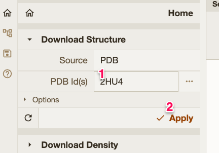 |
| database using the IDs.                           |                          |
+---------------------------------------------------+--------------------------+
| Zoom-in on the structures and see how each        | 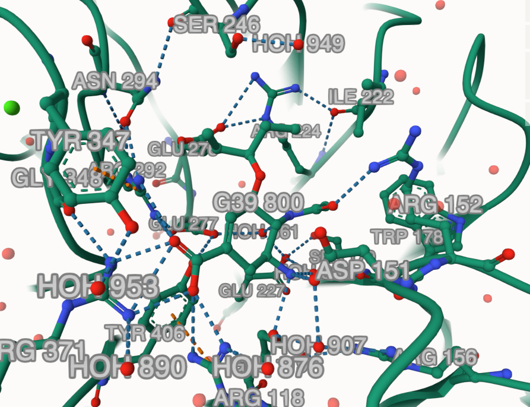  |
| protein interacts with the inhibitor. Just move   |                          |
| the mouse pointer over each residue and you will  |                          |
| easily identify them by a label on the            |                          |
| bottom-right corner.                              |                          |
|                                                   |                          |
| Tips:                                             |                          |
|                                                   |                          |
| -   Zoom in/out usually works with your mouse     |                          |
|     scroll                                        |                          |
|                                                   |                          |
| -   Left button for rotation                      |                          |
|                                                   |                          |
| -   Right button (or control+left button) for     |                          |
|     translation without rotation.                 |                          |
|                                                   |                          |
| -   With SHIFT+Scroll you can move the Z-axis (I  |                          |
|     mean perpendicular to the screen plane) and   |                          |
|     show a “section plane” within the structure.  |                          |
+---------------------------------------------------+--------------------------+
| Trick:                                            | 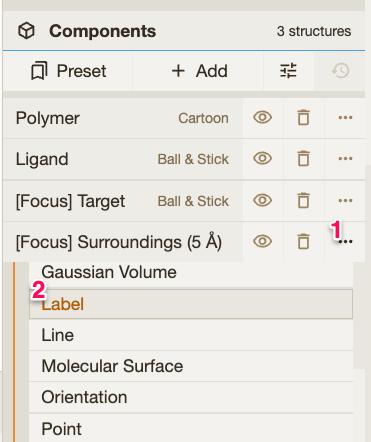 |
|                                                   |                          |
| Click on the drug molecule and then use the right |                          |
| menu to change anything in the representation of  |                          |
| the surrounding environment of the drug.          |                          |
|                                                   |                          |
| For instance, you can add labels using            |                          |
| `[Focus] Surroundings` \> `Add Representation` \> |                          |
| `Labels`                                          |                          |
|                                                   |                          |
| Then click in the `...`to close that menu.        |                          |
|                                                   |                          |
| Do it for one monomer in each structure to see    |                          |
| the differences in the binding pocket.            |                          |
+---------------------------------------------------+--------------------------+
| You can also remove water molecules and extra     | 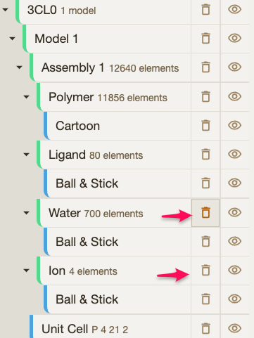 |
| ions that will not be useful for us at this       |                          |
| point.                                            |                          |
+---------------------------------------------------+--------------------------+

### 3. Now we want to compare them and check the details.

+---------------------------------------------------+--------------------------+
| To align the structures:                          | 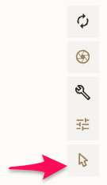  |
|                                                   |                          |
| 1\. Select the “Toggle” tool                      |                          |
+---------------------------------------------------+--------------------------+
| 2\. Change the level for selecting to CHAIN       | 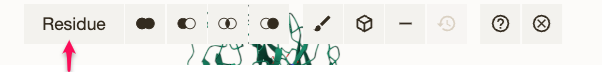  |
|                                                   | 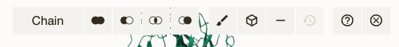  |
+---------------------------------------------------+--------------------------+
| 3\. Select one chain from each structure.         | 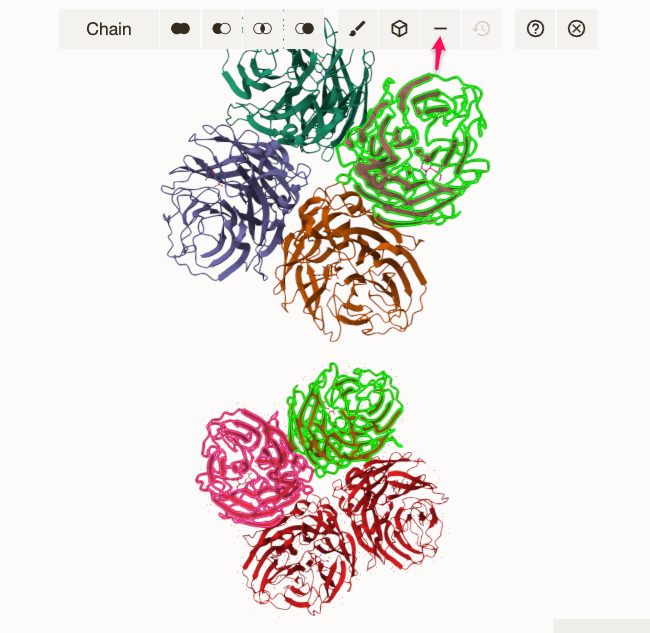 |
|                                                   |                          |
| Tip:                                              |                          |
|                                                   |                          |
| Optionally, you can remove all the unwanted       |                          |
| chains but one using the `-` option (indicated    |                          |
| with the pink arrow) to keep the exercise simpler |                          |
| by using monomeric structures.                    |                          |
+---------------------------------------------------+--------------------------+
| 4\. Align them with the `Superposition` tool.     | 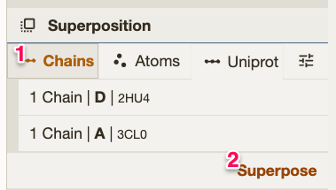  |
|                                                   |                          |
| The RMSD will be on the history bar (on the       |                          |
| bottom).                                          |                          |
+---------------------------------------------------+--------------------------+

### 4. Compare the residues in binding pocket.

::: callout-tip
Focus especially on residues 274 and 276 in each structure.
:::

### 5. We just found a new virus with the following neuraminidase sequence:

```         
>New_neuraminidase
MNPNQKILCTTATAIVIGSIAVLIGIANLGLNIGLHLKPICNCSHSQPEATNASQTIINNYYNETNITQI 
SNTNIQMEERASRGFNNLTKGLCTINSWHIYGKDNAVRIGENSDVLVTREPYVSCDPDECRFYALSQGTT 
IRGKHSNGTIHDRSQYRALISWPLSSPPTVYNSRVECIGWSSTSCHDGKSRMSICISGPNNNASAVVWYN 
RRPVAEINTWARNILRTQESECVCHNGSAVCPVVYTDGSATGPFDYRIYYFKEGKSALRWESLTGTAKWI
ERCSCYGERTGITCTCRDNWQGSNRPVIQIDPVAMTHTSQYICSPVLTDNPRPNDPNVGKCNDPYPGNNN
NGVKGFSYLDGVNTWLGRTISTASRSGYEMLKVPNALTDDRSKPIQGQTIVLNTDWSGYSGSFMDYWAEG
DCYRACFYVDLIRGRPKEDKVWWTSNSIVSMCSSTEFIGQWNWPDGAKIEYFLGSA
```

-   Try to obtain a structural model of that protein sequence.
-   Check the target-template alignment and the model quality (Structure
    Assessment blue button).

+---------------------------------------------------+--------------------------+
| You can use SWISS-MODEL:                          | 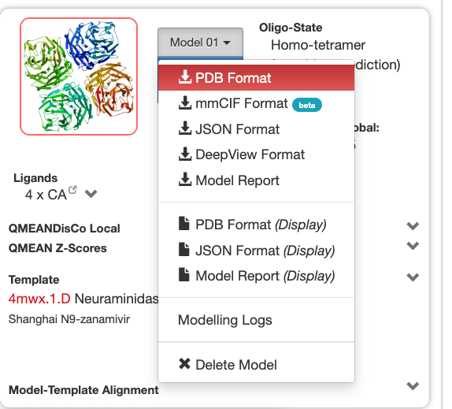 |
| <https://swissmodel.expasy.org/>                  |                          |
|                                                   |                          |
| All the top templates are very similar, thus you  |                          |
| can pick the first one to construct your model.   |                          |
|                                                   |                          |
| Once you construct your model, you can download   |                          |
| it in PDB format.                                 |                          |
+---------------------------------------------------+--------------------------+
| Import your model in Mol\* using the `Open Files` | 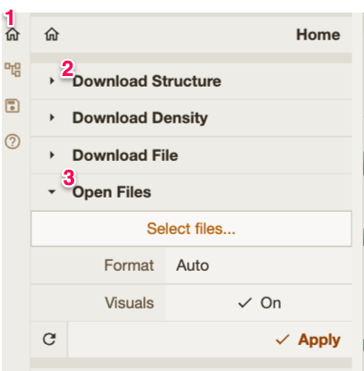 |
| option in the `Home` menu (then click Apply) and  |                          |
| compare your model with the other structures.     |                          |
| Note that the numbers for equivalent residues in  |                          |
| the alignment can be different in each sequence.  |                          |
|                                                   |                          |
| *Tip*: Remember also to change back the selection |                          |
| to “Residue” and switch off the *toggle* option.  |                          |
+---------------------------------------------------+--------------------------+
| Help: Try to solve the whole exercise yourself,   | 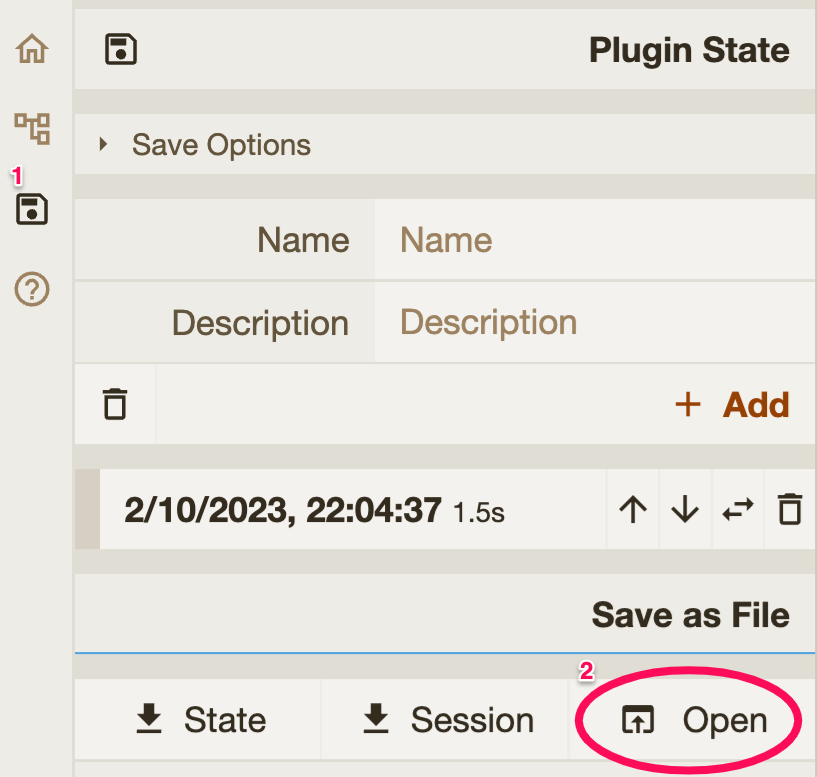 |
| but if you have trouble comparing the three       |                          |
| proteins, at this point you can view my work      |                          |
| session containing the three structures:          |                          |
| [link](mol-star_state_2023-10-3-10-33-7.molx)     |                          |
|                                                   |                          |
| You can import it using the OPEN option in the    |                          |
| `Save Options` menu. *Note that this remove all   |                          |
| your previous work if unsaved.*                   |                          |
|                                                   |                          |
| After opening the session you should rotate and   |                          |
| select the drug molecules to show the binding     |                          |
| pocket in the structures. Then you can select the |                          |
| residue you want to check.                        |                          |
+---------------------------------------------------+--------------------------+

Now, compare the position of the drug and interacting residues within the
binding pocket in structures 2HU4 (sensitive) and 3CL0 (resistant) with the
structure of the binding pocket in your model.

### 6. Go back to Moodle and answer the quiz entitled ***Structural Bioinformatics Assignment.***
