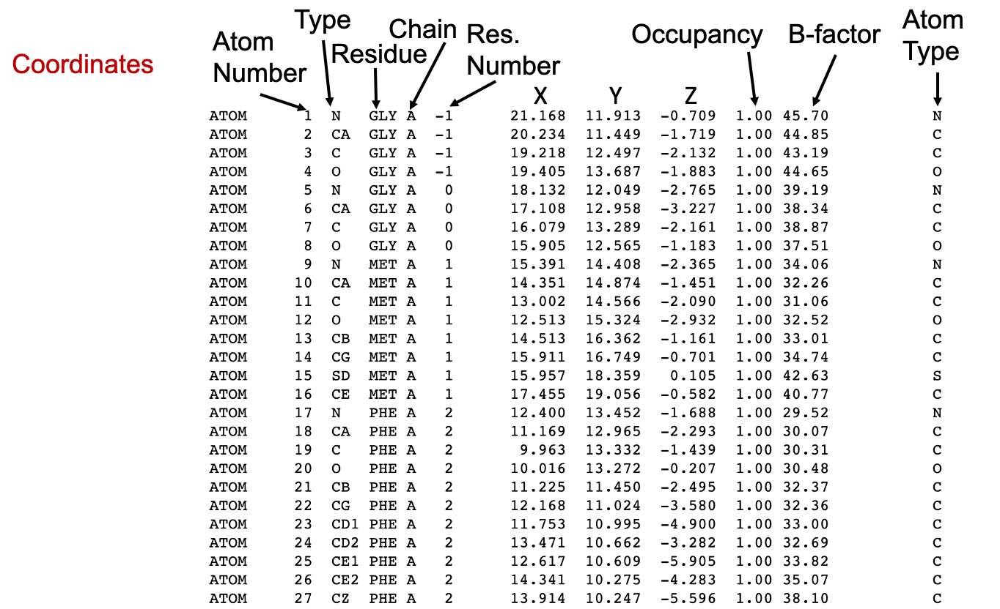

```{r echo=FALSE, output=FALSE}

library(webexercises)
```

# Obtaining and working with protein structures

.](pics/magritte.png "Ceci n'est pas une proteine"){#fig-magritte
.figure}

The surrealist Belgian painter René Magritte created a collection of
surrealistic paintings entitled [***La trahison des images***
(1928--1929)](https://en.wikipedia.org/wiki/The_Treachery_of_Images "Magritte").
The most famous of these paintings show a smoking pipe with the following
caption underneath: *"Ceci n'est pas une pipe"* (This is not a pipe). Yes,
indeed! It is actually a painting of a pipe.

::: callout-warning
## Warning for current and future structural biologists

An image of a protein, or a computer file with the coordinates of a protein
structure, does not constitute the actual protein. Rather, it represents **one**
possible conformation of that protein.
:::

Even experimentally determined structures have two major limitations that should
*be kep*t in mind: (1) they represent a fixed structure (except those based on
NMR), whereas proteins in vivo are flexible and dynamic, and (2) they are
subject to experimental error and often contain low-confidence regions (see
@sec-assess below). Furthermore, even experimentally determined macromolecular
structures are, to some extent, models with varying ratios between experimental
data and computational predictions used to match the experimental data (such as
X-ray diffraction, cryo-EM density maps, NMR, SAXS, FRET...) with previously
known structures or models. It is important to note that while protein
structures can be highly valuable, we must remain cognizant of their limitations
and applications.

# Experimental determination of protein structures

The structural analysis of proteins is crucial for understanding the molecular
mechanisms underlying their functions in detail. A three-dimensional
representation facilitates the orientation of various domains, motifs, or
residues of interest, which is essential for comprehending population or
pathogenic variants, drug design, and protein engineering. Additionally, protein
structures can aid in predicting function and evolutionary relationships, as
structural conservation is higher than sequence conservation; the protein
structure space is smaller than the sequence space. However, obtaining accurate
and detailed structural data can be both technically challenging and
time-consuming. As discussed, protein structure modeling often serves as a
valuable complement or alternative. Experimentally derived structures are
typically obtained through X-ray crystallography, nuclear magnetic resonance
(NMR), or electron cryomicroscopy (CryoEM).

## X-ray crystallography or single crystal X-ray diffraction

X-ray crystallography, also known as single-crystal X-ray diffraction, is a
technique used to determine the atomic structure of molecules within crystalline
forms. This process involves creating a crystal of the molecule of interest,
which is then positioned on a goniometer and exposed to a focused beam of X-rays
(@fig-xray). The resulting diffraction pattern produced by the X-rays passing
through the crystal allows for the determination of the atomic positions,
chemical bonds, crystallographic disorder, and various other structural details.
Interpreting the relationship between the diffraction pattern and the electron
density requires complex mathematical calculations, specifically involving
[Fourier
transforms](http://pruffle.mit.edu/atomiccontrol/education/xray/fourier.php), to
generate a 3D *model* of the structure.

.](images/paste-F430F5B1.png){#fig-xray
.figure}

When collecting X-ray diffraction data from a crystal, we measure the
intensities of diffracted waves scattered in all directions. These measurements
give us the amplitudes but not the phase information needed to reconstruct an
image (density map) of the molecule, which is known as the ‘phase problem’. This
issue becomes more challenging with missing or poor data. In protein
crystallography, phases are often obtained using atomic coordinates of a similar
protein (molecular replacement, MR) or by identifying heavy atom positions.
Heavy atoms scatter X-rays more strongly than lighter ones, helping us determine
their positions within the crystal. By comparing diffraction patterns of the
original crystal and one with added heavy atoms, we can deduce phase information
through isomorphous replacement. Heavy atoms act as reference points to recover
lost phase information, crucial for reconstructing the 3D structure of the
molecule. Molecular replacement finds models that fit experimental intensities
from known structures, typically needing to cover at least 50% of the total
structure with a low Cα r.m.s.d. About 70% or more of PDB structures have been
solved using this method, with the number rising as more homologous structures
become available [@abergel2013]. Advances in *de novo* protein structure
prediction have led to protocols like MR-Rosetta, QUARK, AWSEM-Suite,
I-TASSER-MR, and Alphafold-guided MR, which generate native-like decoy
structures useful for solving the phase problem [@wang2025].

X-ray diffraction is a powerful technique that enables the acquisition of
high-resolution atomic-level structures of both soluble and membrane proteins,
whether as apoenzymes or holoenzymes bound to a substrate, cofactor, or drugs.
However, the protein sample must be crystallizable (i.e., homogeneous),
necessitating a substantial amount of very pure protein. A further limitation of
X-ray structures is that they provide only one (or very few) static forms of the
protein, and the locations of hydrogen atoms cannot be determined by
conventional diffraction methods. Due to their single electron, hydrogen atoms
are difficult to detect accurately with X-rays, which scatter at the electron
density. Although hydrogen atoms can be predicted, this limitation still
complicates some chemical analyses. Some proteins retain full functionality,
permitting in crystallo experiments with certain enzymes [@chang2023], but there
are also numerous examples where crystallization may lead to a biased
representation of the protein and result in structural artifacts.

## Nuclear Magnetic Resonance

All atomic nuclei are charged, rapidly spinning particles that produce unique
resonance frequencies for each atom. When a magnetic field is applied, an
electromagnetic signal with a frequency characteristic of the magnetic field at
the nucleus can be detected. This principle forms the basis of nuclear magnetic
resonance (NMR, @fig-rmn).

It is important to note that the motion of the nucleus is not isolated; it
interacts both intra- and intermolecularly with surrounding atoms. Consequently,
nuclear magnetic resonance spectroscopy can provide structural information about
specific molecules. For instance, in proteins, secondary structures such as
α-helices, β-sheets, and turns indicate various arrangements of main chain atoms
in three-dimensional space. The distances between atomic nuclei in these
secondary structures, their interactions, and the dynamic properties of
polypeptide segments all directly reveal the three-dimensional structure of
proteins. These nuclear characteristics contribute to the spectroscopic behavior
of the sample, yielding distinctive NMR signals. Computational interpretation of
these signals facilitates the determination of the protein’s three-dimensional
structure.

.](images/paste-2013F0AC.png){#fig-rmn
.figure}

The primary advantage of the NMR method is that it allows for the direct
measurement of the three-dimensional structure of macromolecules in their
natural state in solution. NMR provides information about the dynamics and
intermolecular interactions of these molecules. The resolution of the
three-dimensional structure can extend to the subnanometer range. However, the
NMR spectrum of large biomolecules is complex and challenging to interpret,
limiting its application to analyzing large biomolecules, typically below 20-30
kDa (see @fig-experimental). Additionally, this technique requires relatively
large amounts of pure samples (several milligrams) to achieve a reasonable
signal-to-noise ratio.

[{#fig-experimental
.figure}](https://doi.org/10.1016/j.jsb.2022.107841)

## Electron cryomicroscopy

The fundamental principle of Cryo-EM is electron scattering, similar to other
electron microscopy methods. Samples are prepared through cryopreservation prior
to analysis. Then, an electron source is used as a light source to measure the
sample. After the electron beam passes through the sample, a lens system
converts the scattered signal into a magnified image recorded on the detector. A
crucial subsequent step is signal processing, which transforms thousands of
images of the particles in various orientations into a three-dimensional
structure of the sample.

.](images/paste-5E29F580.png){#fig-cryoEM
.figure}

Traditionally, the use of electron microscopy methods for structural biology was
limited to large macromolecular complexes, such as viral capsids (see
@fig-experimental). Recently, it has also been applied to smaller particles. The
number of protein structures determined by cryo-electron microscopy has
significantly increased over the past 5-10 years (check it at PDB:
<https://www.rcsb.org/stats/all-released-structures>). This increase is due to
several technical improvements in the technique (@fig-cryoEM2), including sample
preparation and preservation, analysis, and processing, allowing for
atomic-level imaging [@callaway2020]. These advancements were recognized by the
awarding of the [2017 Nobel Prize in
Chemistry](https://www.nobelprize.org/prizes/chemistry/2017/press-release/) to
Jacques Dubochet, Joachim Frank, and Richard Henderson. .

.](images/paste-E5E5AE75.png){#fig-cryoEM2
.figure}

::: {.callout-info collapse="true"}
### Tip

Check the already classic article by @egelman2016 for more a detailed info. And
[here](https://www.chemistryworld.com/news/explainer-what-is-cryo-electron-microscopy/3008091.article)
for a great outreaching article after the Nobel Prize.
:::

CryoEM is commonly used today, especially for large molecular complexes or viral
particles. It allows structures to be generated quickly, requires a minimal
amount of protein, and can produce reliable data even with impurities present.
However, new generation microscopes are typically only affordable for large
institutions, and small particles often have a high level of noise.
Additionally, processing a large number of images can be challenging when aiming
to obtain high-quality structures.

# Structural quality assurance {#sec-assess}

As mentioned at the outset of this section, every structure, regardless of its
origin or method of determination, is susceptible to error. Experimentally
determined structures are, in reality, models that have been constructed to
align with experimental data. The quality of the initial data and the precision
of the experimental procedures significantly influence the reliability of the
structural outcomes. Similar to other scientific disciplines, independent
experiments can yield related models of the same molecule, though there are
typically variations; nonetheless, both models may still be considered accurate
representations.

::: callout-note
### Extra info

Check the detailed documentation about PDB validation report
[here](https://www.wwpdb.org/validation/XrayValidationReportHelp).
:::

## Global parameters in experimentally-based structures

There are a number of different parameters that help us understand the quality
and reliability of a structure. First, the **resolution** is a good indicator of
the level of detail of the structure, as it can greatly affect affect how the
experimental data are modeled.

 and
[concanavalin.txt](../concanavalin.txt) in the Repo for details about the
picture display).](images/paste-C3031EBE.png){#fig-reso .figure}

 Embedded reproduction of the @fig-reso
with *Mol\**, which allow you to explore the structures.

Another important parameter is the ***R*****-factor**, which is the difference
between the structure factors calculated from the model and those obtained from
the experimental data. That is, the *R*-factor is the deviation between the
calculated diffraction pattern of the model and the original experimental
diffraction pattern. Typically, good structures with a resolution of 1-3 Å, have
an *R-*factor of 0.2 (i.e., 20% of deviation). However, it should be noted that
this factor is usually reduced after iterative refinement, which downplays its
use as an indicator of reliability. A more reliable factor is the ***R~free~***
factor. This is less susceptible to manipulation during refinement, as it is
based on only a small portion of the experimental data (5-10%) that is not used
during the refinement phase.

A more intuitive, but only qualitative, way to understand the precision of the
coordinates of a given atom is the *B-*factor. The temperature value or
*B-*factor correlates with the position errors, although its mathematical
definition is more complex. Normal values for a B-factor are in the range of
14-30, while values above 30 usually indicate that the atom is in a flexible or
disordered region, and atoms with a *B-*factor above 40 are often ruled out as
too unreliable.

The root-mean-squared deviation (**RMSD,** [see Structure alignment
section](ddbb.html#sec-alignment)) is a traditional estimator of the quality of
NMR-solved structures. Regions with high RMSD values are those that are less
defined by data. However, it should also be noted that this parameter can be
also misleading, as it is highly dependent on the procedure used to generate and
select the data that is submitted to the PDB. An experimentalist could reduce
the RMSD by selecting the "best" few structures for deposition from a much
larger draft. Note that the RMSD has many other applications, like comparing
different structures or models from the same or related sequences.

In recent years, with the increase of quantity and quality of EM structures, new
parameters have also been proposed. One of them, the ***Q-*****factor** was
recently introduced for [validation of 3DEM/PDB
structures](https://www.rcsb.org/news/feature/62de9e5235ec5bb4ddb19a43).
Briefly, the Q-factor score calculates the resolvability of atoms by measuring
the similarity of the map values around each atom relative to a Gaussian-like
function for a well resolved atom. A Q score of 1 means that the similarity is
perfect, while a value close to 0 indicates low similarity. If the atom is not
well placed in the map, a negative Q value can be given. Therefore, Q-factor
values in the reports range from -1 to +1.

## Stereochemical parameters

Since all structural models contain some degree of error and some of the global
modeling parameters may be controversial, we can analyze the geometry,
stereochemistry, and other structural properties of the model to evaluate
structural models. These parameters compare a given structure to what is already
known about that type of molecule based on our knowledge from high-resolution
structures. This means that the structures in the current structure space define
what is "normal" in a protein structure. The advantage of these analyses and
derived parameters is that they do not take into account the process that leads
to the model, only the final product and its reliability. The main disadvantage
is that the current structure space is focused on proteins with known function
and of biomedical or biotechnological interest.

One of the most common and powerful methods for assessing the stereochemistry of
a protein is the [Ramachandran plot](intro.html#sec-rama), which was defined in
1963 and is still in use.

Another widely used analysis (available for all PDB structures) is the side
[chain torsion
angles](https://www.wwpdb.org/validation/XrayValidationReportHelp#torsion_angles),
usually measured as ***Side chain outliers**.* As described in the
[Introduction](intro.html#sec-str), the amino acid side chains also have some
preferred conformations. Like the Ramachandran plot, the plot of the χ1-χ2
torsion angles can indicate problems with a protein model if the angle values
are outside of the high density values.

Bad contact or
[clashes](https://www.wwpdb.org/validation/XrayValidationReportHelp#close_contacts)
indicate a poor model. It is obvious that two atoms cannot be in the same (or a
very close) location. We can define this as a situation where two unbound atoms
have a center-to-center distance smaller than the sum of their van der Walls
radii.

# Protein structure display {#sec-apps}

## Protein structure file formats

Experimental structural data from different methods are stored in different file
formats. For instance, raw crystallographic data are usually stored as `*.ccp4`
files, but Cryo-EM or X-ray density maps can be stored in `*.mrc` or `*.mtz`
files. Other complex file formats, such as the Extensible Markup Language
`*.xml`, provide a framework for structure complex information and documents
like protein structures.

Along with the establishment of the Protein Data Bank, a simple and standardized
format was developed. The *Brookhaven* or `PDB` format consists of line records
in a fixed format describing atomic coordinates, chemical and biochemical
features, experimental details of the structure determination, and some
structural features such as secondary structure assignments, hydrogen bonding,
or active sites. The current version is named PDBx/mmCIF) also incorporates the
expanded crystallographic information file format (mmCIF), which allows the
representation of large structures, complex chemistry, and new and hybrid
experimental methods. Thus a `*.pdb` and `*.cif` files can be considered as
identical files.

::: {.callout-tip collapse="true"}
### PDB-101

Check PDB-101 course about PDBx/mmCIF format at PDB RCSB site
[here](https://pdb101.rcsb.org/learn/guide-to-understanding-pdb-data/beginner%E2%80%99s-guide-to-pdb-structures-and-the-pdbx-mmcif-format).
:::

{#fig-PDBfile
.figure}

### Occupancy and B-factor

Except for the repetition of the atom type in the rightmost column, the last
columns in the PDB file are the **Occupancy** and the **temperature factor** or
the **B-factor**.

Macromolecular crystals consist of many individual molecules packed in a
symmetrical arrangement. In some crystals there are slight differences between
the individual molecules. For instance, a sidechain on the surface may wag back
and forth between several conformations, or a substrate may bind in two
orientations at an active site, or a metal ion may be detected as bound to only
a few of the molecules. When researchers build the atomic model of these
portions, they can use the occupancy to estimate the amount of each conformation
observed in the crystal. Therefore, by definition, the sum of **occupancy**
values for each atom must be 1. Usually, we see a single record for an atom,
with an occupancy value of 1, indicating that the atom is found in all of the
molecules in the same place in the crystal. However, if a metal ion binds to
only half of the molecules in the crystal, the researcher sees a faint image of
the ion in the electron density map and can assign an occupancy of 0.5 for this
atom in the PDB structure file. For each atom, two (or more) atom records are
included with occupancies such as 0.5 and 0.5, or 0.4 and 0.6, or other
fractions of occupancies that sum to a total of 1.

On the other hand, the **temperature value or *B*-factor is** a measure of our
confidence in the location of individual atoms, as described above
(@sec-assess). If you find an atom with a high temperature factor on the surface
of a protein, keep in mind that this atom is likely to be moving around a lot
and that the coordinates given in the PDB file are only a possible snapshot of
its location. Thus, an atom dataset with an occupancy \< 1 may have a low
B-factor if that position is safe.

As you can imagine, this column is also used by computationally derived models
to indicate a confidence value that can be parsed for diverse purposes,
including structure coloring.

## Biological macromolecules display applications

### PyMOL

[PyMOL](https://en.wikipedia.org/wiki/PyMOL) is a very powerful molecular
visualization system written originally by [Warren
DeLano](https://en.wikipedia.org/wiki/Warren_Lyford_DeLano). It was released in
2000 and soon became very popular. It's currently commercialized under License
by [Schrödinger](https://pymol.org/) but a free license for teaching can be
requested. Also, open source code is available on
[GitHub](https://github.com/schrodinger/pymol-open-source) that can be installed
on Linux or MAC. More info on [Wikipedia](https://en.wikipedia.org/wiki/PyMOL).
You can also check this quick [Reference
guide](https://www.uml.edu/docs/PyMOL%20Quick%20Reference%20Guide_tcm18-230352.pdf)

PyMOL allows working with different structures representation, but also with raw
experimental data in different
[formats](https://pymol.org/dokuwiki/doku.php?id=format).

PyMOL is written in Python and can be used with interactive menus and also with
command line. There are a lot of resources that can help you with PyMOL, like a
[Documentation Reference Wiki](https://pymol.org/dokuwiki/) or a
community-supported [PyMOLWiki](https://pymolwiki.org/index.php/Main_Page).
Moreover, it allows the implementation of new functionalities as plugins
[@rosignoli2022], like [PyMod](http://schubert.bio.uniroma1.it/pymod/index.html)
or [DockingPie](http://schubert.bio.uniroma1.it/dockingpie/index.html), among
others. [PyMod](https://pymolwiki.org/index.php/PyMod) [@janson2021] is designed
to act as simple and intuitive interface between PyMOL and several
bioinformatics tools (i.e., PSI-BLAST, Clustal Omega, HMMER, MUSCLE, CAMPO,
PSIPRED, and MODELLER). Starting from the amino acid sequence of the target
protein, PyMod is designed to carry out the main steps of the homology modeling
process (that is, template searching, target-template sequence alignment and
model building) in order to build a 3D atomic model of a target protein (or
protein complex). The integration with PyMOL facilitates a detailed analysis of
the modeling process.

Finally, as any Python-based program, it can be used within Jupyter notebooks
(see <https://www.computer.org/csdl/magazine/cs/2021/02/09354947/1rgCkrAJCko>).

### UCSF ChimeraX

[ChimeraX](https://www.rbvi.ucsf.edu/chimerax/) [@pettersen2021] is a fully open
source software, developed by the UCSF as a renovated version of the former
[Chimera](https://www.cgl.ucsf.edu/chimera/) software, with versions for Linux,
MacOS, and Windows. It aims to be a comprehensive structural biology tool, but
it is more widely known for its capacities for EM maps. As any other open source
software, it has gained new and exciting capacities in the last years, like
[Virtual Reality
capabilities](https://www.rbvi.ucsf.edu/chimerax/docs/user/vr.html) or
[Alphafold2](https://www.rbvi.ucsf.edu/chimerax/data/alphafold-nov2021/af_sbgrid.html)
modeling.

::: callout-note
There is an excellent ChimeraX User Guide, with examples at the RBVI\@UCSF site
[here](https://www.rbvi.ucsf.edu/chimerax/docs/user/index.html).
:::

### Molecular structures on your website: Mol\* and others

[LiteMol Viewer](https://www.litemol.org/Viewer) is a powerful HTML5 web
application for 3D visualization of molecules and other related data. It is used
in a web browser, eliminating the need for external software and also allowing
the integration with third-party sites as an embedded plugin. More information
about LiteMol can be found on @sehnal2017, the
[wiki](https://webchem.ncbr.muni.cz/Wiki/LiteMol:UserManual), or [YouTube
tutorials](https://www.youtube.com/channel/UCRoyYUeP1hdH2r8XUW-WMoA).

The same philosophy applies to other open-source viewers that were developed
later and are now more widely used, like [NGL Viewer](https://nglviewer.org/)
and [Mol\*](https://molstar.org/) @sehnal2021, used in
[RCSB-PDB](https://www.rcsb.org/) and [PDBe](https://www.ebi.ac.uk/pdbe/) sites
for 3D visualization of structures. With *Mol\** you can save your work session
in `molj` (without the actual structures) or `molx` (with embedded structures)
formats, as in the [Figure 8](#fig-molstar) above.

Finally, for computational scientists, there are also many libraries that allow
3D molecules representation, like 3Dmol Javascript library and its Python
wrapper [**Py3Dmol**](https://github.com/avirshup/py3dmol), which you can use in
Colab, Jupyter, Quarto or any other Python notebook (see code examples
[here](https://william-dawson.github.io/using-py3dmol.html) or
[here](https://colab.research.google.com/github/CCBatIIT/modelingworkshop/blob/main/labs/1-1/py3DMol.ipynb)).

## Parsing multiple structures 

Python offers several robust libraries for parsing and visualizing protein
structures. Biopython is widely utilized for parsing PDB files, while libraries
such as NGL, Py3Dmol, or matplotlib (with creative geometry) are effective for
visualization. Biopython is essential for parsing and working with protein
structure data, irrespective of the chosen visualization library.

-   [**Py3Dmol**](https://william-dawson.github.io/using-py3dmol.html)**:**
    Suitable for basic visualizations and web embedding.

-   [**NGL**](https://github.com/nglviewer/nglview)**:** Highly powerful and
    feature-rich, offering interactive capabilities, commonly used in
    bioinformatics. Requires Jupyter extensions.

-   [**ProDy**](http://www.bahargroup.org/prody/index.html)**:** Protein
    structure analysis and dynamics as well as insights that make protein
    visualizations more informative. It's not a standalone visualization library
    but a valuable companion to libraries like NGL, Py3Dmol, and Matplotlib.
::: {.callout-info collapse="true"}
### I encourage you to try one of the following Colab notebooks to see how to display and analyze structures with Python:
- *py3DMol:* https://colab.research.google.com/github/CCBatIIT/modelingworkshop/blob/main/labs/1-1/py3DMol.ipynb
- *py3DMol and MDAnalysis:* https://colab.research.google.com/github/pb3lab/ibm3202/blob/master/tutorials/lab02_molviz.ipynb
- *py3DMol and NGLView:* https://colab.research.google.com/github/pb3lab/ibm3202/blob/master/tutorials/lab02_molviz.ipynb

:::
In R, there are also packages designed for working with protein structures. The
**bio3d** package is fundamental in R for bioinformatics, providing functions
for reading PDB files, analyzing protein structures, and generating basic
visualizations. It can perform calculations such as distances, RMSDs, and other
structural analyses. There is also a very useful Mol\* [Quarto
extension](https://github.com/jmbuhr/quarto-molstar), which I used on this site.
Mol\* can be very easily integrated in many third party services and in your own
website.

::: {.callout-important collapse="true"}
# A tribute to the pioneers

Other applications that you may know, hear about or came into but are now
discontinued are:

-   **SwissPDBViewer** (aka DeepView), developed to work with SWISS-MODEL
    homology modeling app, is an application that provides a user-friendly
    interface allowing to analyze several proteins at the same time. It has
    currently fallen in disuse as the last version (4.1) is only a 32 bits
    application.

-   **RasMol** and **OpenRasMol** were developed initially in 1992 and its last
    release was in 2009. It was a pioneer as a simple molecular display
    open-source application, but it is outdated nowadays.
:::

# [**PyMOL Practice**](pymol.html){style="color:green"}

