```{r echo=FALSE, output=FALSE}

library(webexercises)
```

# Note about installing Pymol

There are two options to use [Pymol](https://www.pymol.org/) in your computer:

1.  Edu license:

    -   STEP 1: Install from <https://www.pymol.org/#download> or by
        [Conda](https://carpentries-incubator.github.io/introduction-to-conda-for-data-scientists/02-working-with-environments/index.html):
        
        ```bash
        conda install -c schrodinger pymol-bundle
        ```
    -   STEP 2: Obtain a License here: <https://pymol.org/edu/>

2.  Open Access version from GitHub:

    -   On Linux: https://pymolwiki.org/index.php/Linux_Install

    -   On MacOs: https://pymolwiki.org/index.php/MAC_Install

    -   UPDATE: for new MacOS you may need to install some dependencies:

        ```bash
        brew install tcl-tk
        ```

3.  Open Access version from `conda-forge` channel:


      ```bash
      conda install -c conda-forge pymol-open-source
      ```


# Part A: A 10-steps self-guided practice to learn Pymol

The first thing to do is to open PyMOL. You can do that by simply
double-clicking on the icon or typing `pymol` in a Terminal window. From here
and on, we will just use PyMOL by typing in the command line on the small window
on top where it says ‘`PyMOL>`’. Feel free to explore the graphical interface on
your own.

The next thing we are going to do is navigate to the directory (folder) where we
want our files to be located. By default (in Linux and MacOS), Pymol opens in
your *home* directory. Inside PyMOL, we can use Linux commands to navigate to
that directory. If you type `ls`, you will see the files and folders that exist
in the home directory and if you type the `cd` command and providing a path you
can chance your working directory.

## 1. Get a structure.

As an example, we are going to work with the PDB structure
[6KI3](https://www.rcsb.org/structure/6ki3). There are two ways to get a
structure ready to work on Pymol, you can open a file in your local machine or
you can *fetch* it from the PDB.

-   If you have already the PDB go to *File* menu \> *Open PDB*

-   You can also fetch the directly from the PDB database, either by menu *File*
    \> *Get PDB* and typing our PDB ID or by Command line:

``` python
fetch 6KI3
```

::: callout-note
**Note:** You can customize the download by specifying one chain or adding the
electron density map in the popup window or by command line. Check the wiki:
<https://www.pymolwiki.org/index.php/Fetch>

**Note2**: If you want to download structural models from AlphaFold you can
install *Alphafold2import* plugin from here:
<https://github.com/APAJanssen/Alphafold2import>
:::

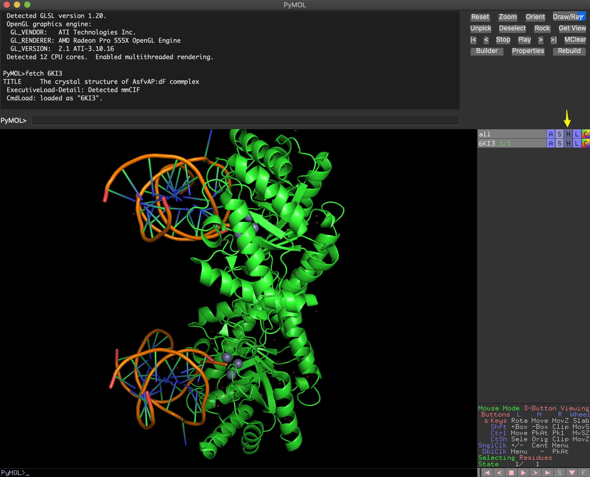

### [What do you see?]{style="color:green"}

First thing you should do is playing around with your mouse. Most of you will
have a 3-Button mouse. The panel in the right-bottom corner contains a
description of mouse controls under the Viewing mode. You can also check it
[here](https://pymol.org/dokuwiki/doku.php?id=mouse). If you have a 2-Button
mouse, you can find more information about how to control the mouse
[here](https://pymol.org/dokuwiki/doku.php?id=mouse:two_button).

Now, try to describe the structure components.

### [What are the small red dots and the big spheres?]{style="color:green"}

Crystallography structures show protein oligomers and may also contain, enzyme
substrates, cofactor or solvent molecules (water and ions). For most purposes,
we may prefer to work only with a monomer and remove the water molecules.

There are two options to remove the water molecules:

a.  Use the ***H**ide* menu on the right hand of the screen (marked with the
    yellow arrow in the picture above).

    -   **H**\>waters

b.  On command-line you can also hide custom solvent:

``` python
hide everything, solvent
show wire, solvent #to bring it back
show nb_spheres, solvent #alternative display
```

c.  Use the *Show* menu

-   **S**\>wire\>not_bounded

As you can imagine, there are many different ways of visualizing the molecules
and features you can show on the screen that you can explore on your own. In
pymol we have *lines, ribbon, surface, everything, mesh, volume, cartoon,
spheres, labels* and *sticks.*

Like in the example above, you can hide/show any representation for an object or
selection using the following sintax:

``` python
hide \[representation\], \[selection-name\]
show \[representation\], \[selection-name\]
```

The `selection-name`is an optional argument and can be very complex or specific,
involving one or more portions of one or more objects.    

::: callout-tip
❗️You can see a detail explanation of the Pymol selection syntax in the Pymol
wiki [here](https://pymolwiki.org/index.php/Selection_Algebra).
:::

::: {.callout-caution collapse="true"}
### ⚠️ Before moving forward: What if I made a mess? ⚠️

Starting in version 1.5, PyMOL contains an `undo` command (also `Ctrl+Z` or
`Cmd+Z`). However, it only affect object edition (changes in the structure), no
changes in visualization or diplaying features. If you made a mess in the
visualization of your molecule(s), you only have two alternatives.

-   Use *File* \> *Reinitialize* to reset PyMOL to its initial state, but all
    work will be lost.

-   **Save your session when you accomplish a wanted display:**

    -   A PyMOL sessions retains the state of your PyMOL instance. You can save
        the session to disk and reload it later. You can setup a complicated
        scene, with transitions and more, and simply save it as a PyMOL Session
        (.pse) file. Use **File**=\>**Save Session** or **Save Session As...**.
        or the command `save` <https://pymolwiki.org/index.php/Save>

    -   Loading sessions is just as easy: **File**=\>**Load** and choose your
        session file with all your molecules with the same visualization.

    -   You can also save temporal scenes within your session, like frozen
        screenshoots while keep working, using the command `scene`:
        <https://pymolwiki.org/index.php/Scene>
:::

## 2. Choose representation and color schemes.

Different types of representation can be selected for each object or selection
with the button **S** on the right panel. There are also wide range of flavors
for each representation. For example, for cartoons:
<https://pymolwiki.org/index.php/Cartoon>. For instance, we can color the
protein by secondary structure using Menu **C**

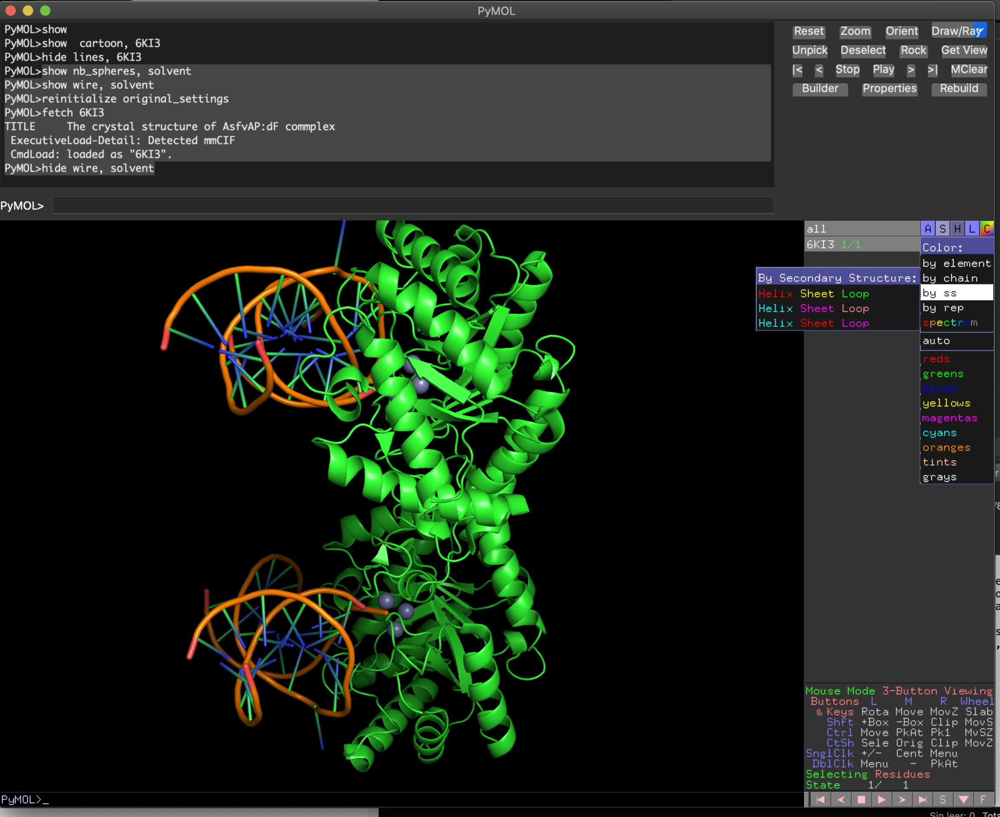

Spectrum color scheme is also useful to follow the secondary structure
succession.

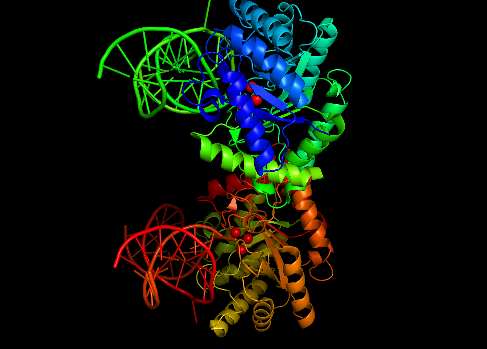

Using upper menu (Settings and Display) we can also change several features of
the image. Try yourself!

It's faster if you just type:

``` python
color tv_orange, ss h
color paleyellow, ss s
color grey, ss l+
set sphere_color, tv_red
bg_color white
```

Note: `l+` will color loops and other unassigned residues, including DNA

🔝🔝Check other coloring alternatives:
<https://pymolwiki.org/index.php/Advanced_Coloring>

For DNA: <https://pymolwiki.org/index.php/Examples_of_nucleic_acid_cartoons>

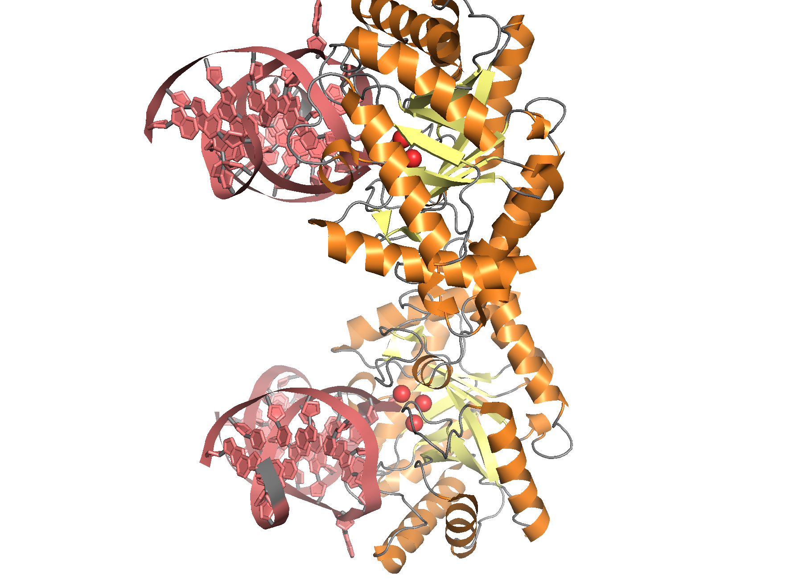

Example:

``` python
set cartoon_ring_mode, 3
set cartoon_nucleic_acid_mode, 4
cartoon oval
cartoon automatic, 6KI3 and chain A or chain B
set cartoon_ring_width, 0.2
set cartoon_ring_color, deepsalmon
set cartoon_nucleic_acid_color, deepsalmon
```

## 3. Create new object and/or get rid of what you don't want

If we want to work only with some objects or chains in the PDB file, you can do
it in several ways. There are several options but you need to **show the
sequence** (Menu Display or button **S** on the [botton-right
corner]{.underline}).

You can remove objects (Option 1A or 1B) or copy a selection to a new object
(Option 2A or 2B). You can test all with the instructions below, but I find more
convenient to use command line alternatives (1B and 2B).

*⚠️️ Note that the options 1 and 2 below are alternative ways to get the same results. Try only
one option each time starting over from 6KI3 structure.⚠️❗️*

-   Option 1A: select in the sequence panel the sequence you want to remove and
    remove it

    ``` python
    remove sele
    ```

-   Option 1B: use command line

    -   Step 1: First you need to see the composition of your structure

    ```bash         
    get_chains 6KI3
    select chain A
    select chain B
    #to see who is who
    ```

    -   Step 2: select the chains you want to remove and remove them

    ``` python
    select kk, chain A or chain C or chain D or chain E
    delete kk
    ```

-   Option 2A: Select in the sequence panel the sequence or whole chains you
    want to keep: **A** \> "Copy to object" or "extract to object" will allow to
    work independently with that portion without removing the rest. Just click
    on the object to disable.

-   Option 2B: use command line

    -   Step 1: Select and create:

    ```python
    select kk, chain B or chain F or chain G or chain H
    create monomer, kk
    ```

Or directly create an object with your selected chains:

  ``` python
  create monomer, chain B or chain F or chain G or chain H
  ```

-   Step 2: Now you can remove the original object (if you wish)

    ``` python
    remove 6KI3
    ```

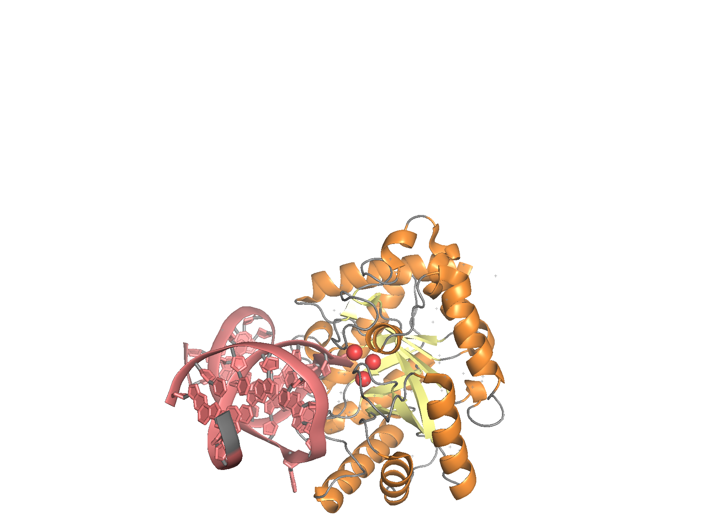

**Some interesting points about selection on Pymol:**

-   Unnamed selection are temporarily named "sele" and replaced after every
    `select` command execution.

-   Selections can be renamed in the **A** (action menu on the left) or by
    command line : <https://pymolwiki.org/index.php/Set_name>

-   Multiple selection can be also done but syntax is tricky:
    <https://pymolwiki.org/index.php/Selection_Algebra>

### [Create your own representation of the monomer ternary complex (protein + metal cofactor + DNA)]{style="color:green"}

## 4. Compare structures

Download some related structures, like 6KHY, 3AAM and 2NQH.

Note that 6KHY also contains several chains. For comparison we don't need the
DNA, so we will use only the protein chain A.

``` python
fetch 6KHY
create 6KHY_monomer, 6KHY and chain A #it also has several chains
delete 6KHY #remove the original structure for clarity
fetch 3AAM
fetch 2NQH
```

Now you should have four structures: `6KI3` (or monomer), `6KHY_monomer`,
`3AAM`, and `2NQH`

Pymol has several alternatives for structural alignments. The three more common
are the commands [*super*](https://pymolwiki.org/index.php/Super),
[*align*](https://pymolwiki.org/index.php/Align)and
[*cealign*](https://pymolwiki.org/index.php/Cealign)*,* depending on the level
of similarity. `super` is very fast and competent when proteins sequences are
very similar, whereas `align` is a very quick alternative and useful for most
purposes with a clear sequence similarity. On the other hand, `cealing` is based
in the CE algorithm and although somewhat slower it provides better structural
alignment for proteins without clear similarity.

``` python
align 6KHY_monomer, 6KI3
align 3AAM, 6KI3
align 2NQH, 6KI3
zoom all #to center the view of all the proteins in the new position
```

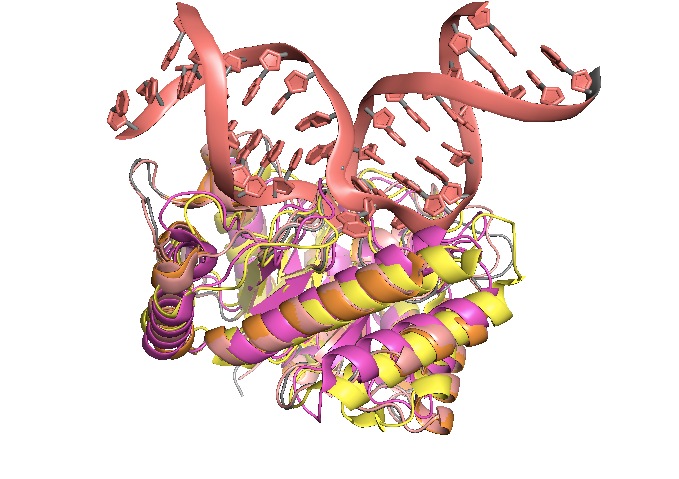

### [Can you range the three new structures by their similarity with 6KI3?]{style="color:green"}


::: callout-tip
# Multiple superposition 
From version 1.7.2, there is also a command to align multiple
structures with a reference molecule, using
[extra_fit](https://pymolwiki.org/index.php/Extra_fit).
:::


## 5. Find what you are looking for

Now we can play with different representations for specific residues, like
catalytic ones: D231, H182, H115, E142, H218, H78, E271, H233.

You can select them directly picking from the sequence. If you want to keep this
selection for the future you can name it in the **A** menu. Using show and color
menu, you can also change how those residues are displayed.

Quick alternative (note the different use of and-or and the parenthesis
<https://pymolwiki.org/index.php/Selection_Algebra>):

``` python
select catalytic_res, monomer and (resi 231 or resi 182 or resi 115 or resi 142 or resi 218 or resi 78 or resi 179 or resi 271 or resi 233)
show sticks, catalytic_res
zoom catalytic_res
```

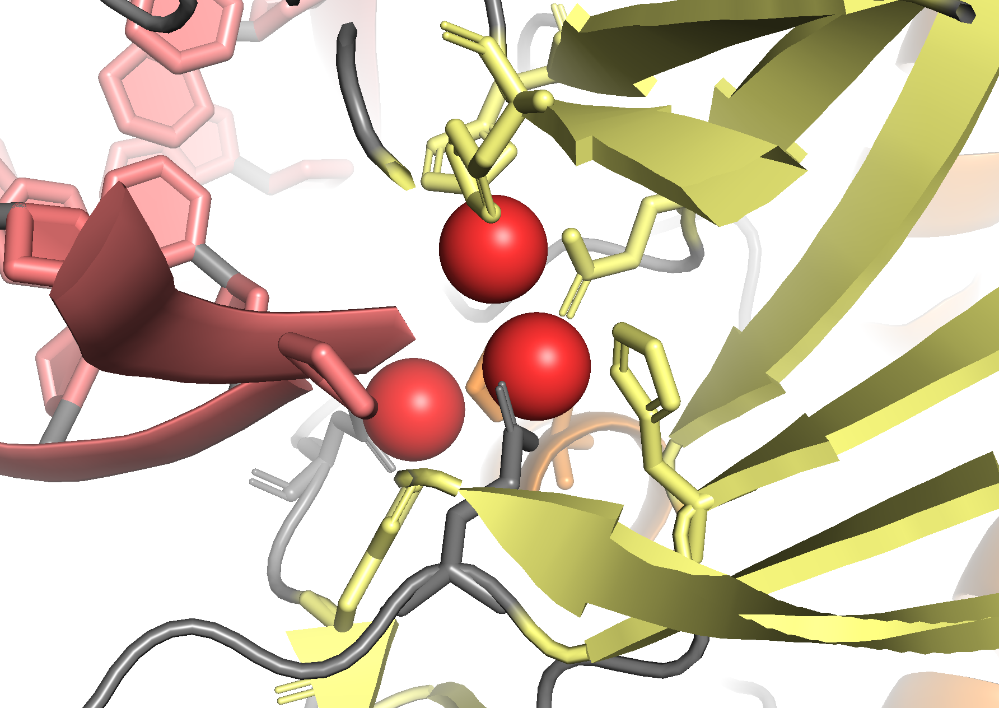

There are also some interesting tricks for disclosing ligand binding or
catalytic sites:

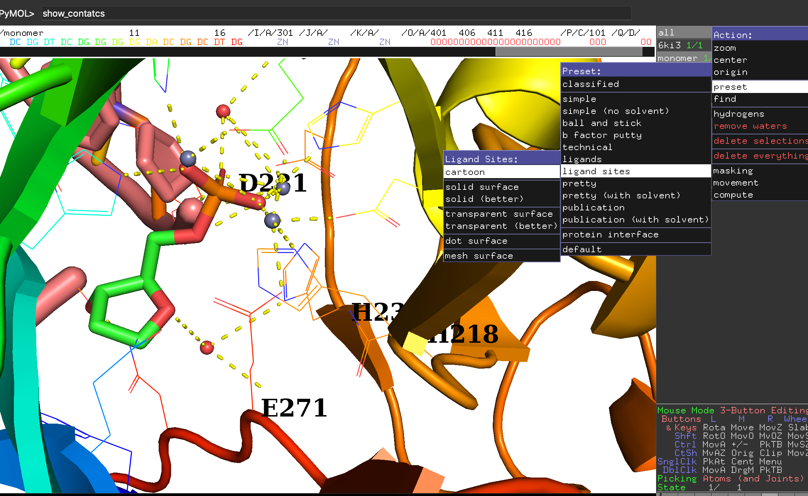

More info about selection of multiple objects in Pymol here:
<https://pymolwiki.org/index.php/Selection_Algebra>

## 6. Highlight what you want

You can also hide the cartoon partly or totally and color by elements

``` python
hide cartoon, monomer and chain A
show sticks, chain D and resi 10
show sticks, catalytic_res
set_bond stick_radius, 0.25, catalytic_res
color red, chain D and resi 10 and elem o
```

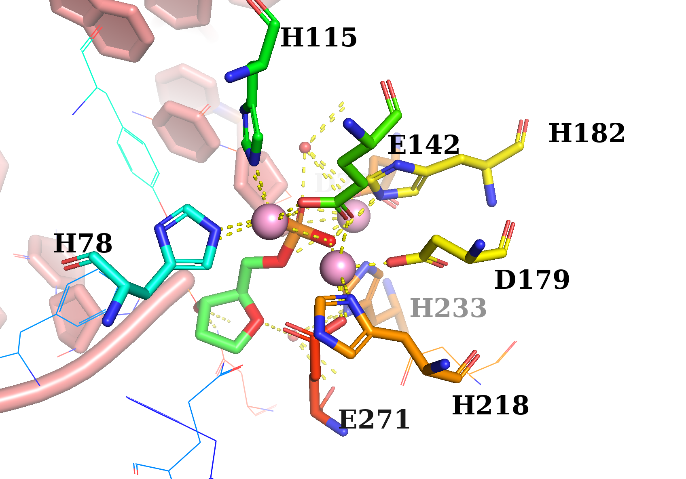

## 7. Show labels

-   Use the **L** menu to show the labels of your object/selection

-   You can also use the command `label` to show labels

``` python
label [selection], [expression]
```

Labels can be [formatted](https://pymolwiki.org/index.php/Label) in different
ways, for example:

``` python
set label_outline_color, black
set label_font_id, 10
set label_size, -2.5
set label_position,(0,0,100), resi 87
```

You can also move the labels with "Edit mode":
<http://polo.engr.colostate.edu/drillbits/lessons/59/#:~:text=To%20get%20labels%20exactly%20where,click%20to%20move%20the%20label.>

*Be careful not to pick on the molecule (UNDO still partial!)*

### [Make a picture of the catalytic center with your custom representation, including labels]{style="color:green"}

## 8. Measure distances

Menu Wizard\>Measurements

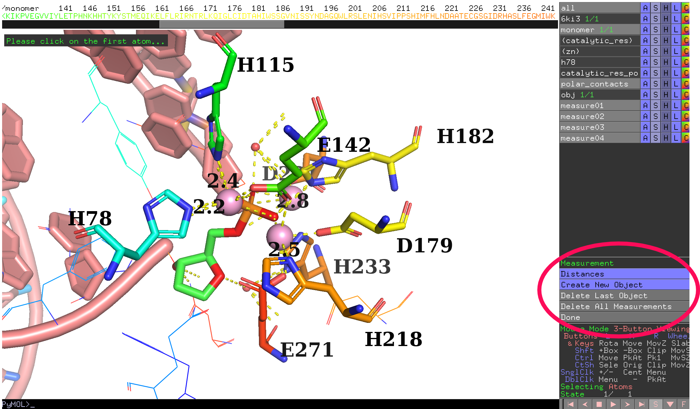

Click "Done" on the right when you are done.

## 9. How to make a high-res picture: RAY IT!

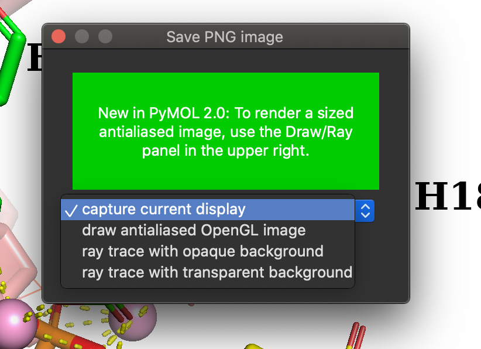

Also by command line:

``` python
set ray_opaque_background, on
set ray_trace_mode, 1
ray
png picture.png
```

or:

``` python
set ray_trace_mode, 1
png /modesto/strbio/picture.png, width=2000, height=1200, dpi=600, ray=1
```

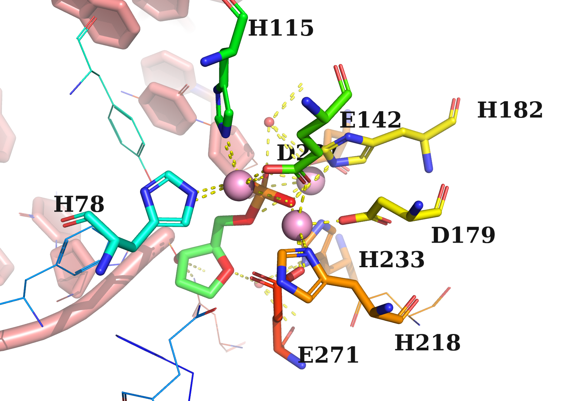

Note that objects in a deeper position look lighter. This is the "fog" effect.
See: <https://pymolwiki.org/index.php/Fog> and
<https://pymolwiki.org/index.php/Depth_cue>

::: callout-tip
## Note

If Ray takes too long, you can try `ray=0` or use `draw`:
<https://pymolwiki.org/index.php/Draw>

See more details in the following links:

<https://pymolwiki.org/index.php/Ray>

<https://pymolwiki.org/index.php/Png>
:::

## 10. BONUS TRACK: More info and useful resources about Pymol.

-   More Pymol exercises:

    -   <http://ubio.bioinfo.cnio.es/people/jrodriguezr/curso_verano_2014/02-Practica_guiada_Pymol.pdf>

    -   <http://www.carlssonlab.org/pdfs/PYMOL.pdf>

    -   <https://rpubs.com/stodolli/121998>

-   Quick Reference Guide for Intermediate PyMOL Users:
    <https://www.uml.edu/docs/PyMOL%20Quick%20Reference%20Guide_tcm18-230352.pdf>

-   Short Pymol book:
    <https://dasher.wustl.edu/chem430/software/pymol/introduction.pdf>

-   Practical Pymol for Beginners:
    <https://pymolwiki.org/index.php/Practical_Pymol_for_Beginners>

-   **PyMOL-based protein structure workbook**

    -   Exploring Protein Structure: Principles and Practice: 
        <https://link.springer.com/book/10.1007/978-3-319-76858-8>

-   Another interesting tutorial:
    <http://www.protein.osaka-u.ac.jp/rcsfp/supracryst/suzuki/jpxtal/Katsutani/en/index.php>

-   **Pymol for Begginers YouTube series in "Swanson Does Science" channel:**
    <https://www.youtube.com/channel/UCz8iGpZDrxv8zu2eJp62uew>

    -   1: Orientation - <https://www.youtube.com/watch?v=wiKyOF-pGw4>

    -   2: Labels - <https://www.youtube.com/watch?v=nFY3EjBNPBQ>

        -   A more advances video here:
            <https://www.youtube.com/watch?v=yBFzJ3ql4qU>

    -   3: Measurements - <https://www.youtube.com/watch?v=lB-0WsZt8M8>

    -   4: H-bonds - <https://www.youtube.com/watch?v=xUdETtfhens>

    -   5: Alignments - <https://www.youtube.com/watch?v=T0v1Dx6Yb-I>

        -   TRICK: <https://pymolwiki.org/index.php/TMalign>

        -   Alternative: FATCAT2 <http://fatcat.godziklab.org/>

    -   6: Mutagenesis - <https://www.youtube.com/watch?v=M-VCBz83nfs>

-   **Active sites with Pymol:** <https://www.youtube.com/watch?v=mBlMI82JRfI>

-   **Create movies with Pymol**:
    <https://pymol.org/tutorials/moviemaking/#:~:text=Moviemaking%20concept,the%20key%20frames%2C%20if%20applicable>.

--------------------------------------------------------------------------------

# PART B: Paper-style protein figure challenge

**Make a ready-to-publish picture of your favorite protein.**

As a suggestion, you can reproduce the top panels in the Figure 1B of Gao et al.
([2020](https://www.science.org/doi/10.1126/science.abb7498)) or Figure 4b from
Cilleros-Rodríguez et al. ([2022](https://elifesciences.org/articles/78383)),
but any structure involving more than one domain and/or with a
substrate/cofactor molecule can be a good challenge. You may use Pymol or any
other application, including Py3Dmol in a Jupyter Notebook.
