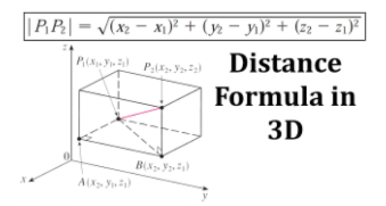

```{r echo=FALSE, output=FALSE}

library(webexercises)
```

# Parsing PDB files

## Learning Goals

1.  Get familiar with `PDB` format and quick alternatives to parse this files.
2.  Understand the meaning of protein contact maps and their correlation with
    protein structure.

## Data

You must parse the following structures from the protein data
bank.

::: panel-tabset
## `1RBP`



## `1QRE`



## `1DGF`


:::


## Tasks

::: callout-important
Choose your favorite flavor! 

You are free to complete this exercise using `Python` or `R`, but **do not use structural biology-specific libraries**, you must write your own functions.
:::

### 1.  Write a function that parses the files and generate a table or report with metadata and key information from the structures, including PDB ID, protein name, source organism, determination method, authors, release date, resolution, and the number of peptide chains and other molecules.

::: callout-tip
You may find some amino acids that are not canonical. If so, you can either
change to the canonical one or use X in the fasta sequence.
:::

### 2.  Parse the data to extract the protein structural information from the PDB file in tabular format, then compute the pairwise distance matrix for each PDB structure. The distance between two amino acids is usually calculated as the 3D Euclidean distance between their C-alpha (CA) atoms.

{width="467" #fig-frost .figure}

### 3.  Write a function for plotting the corresponding contact map for each structure, using a standard contact threshold (between 6-12 Å) and different colors for different contacts (intra- and interchain).

### 4.  Try to interpret the plots. Can you identify any structure in the contact maps?	If so, which ones? Determine the type of structure as well (monomer,homo- or hetero- dimer, tetramer... ).

    				

    			

    		

    	

    				

    			

    		

    	
